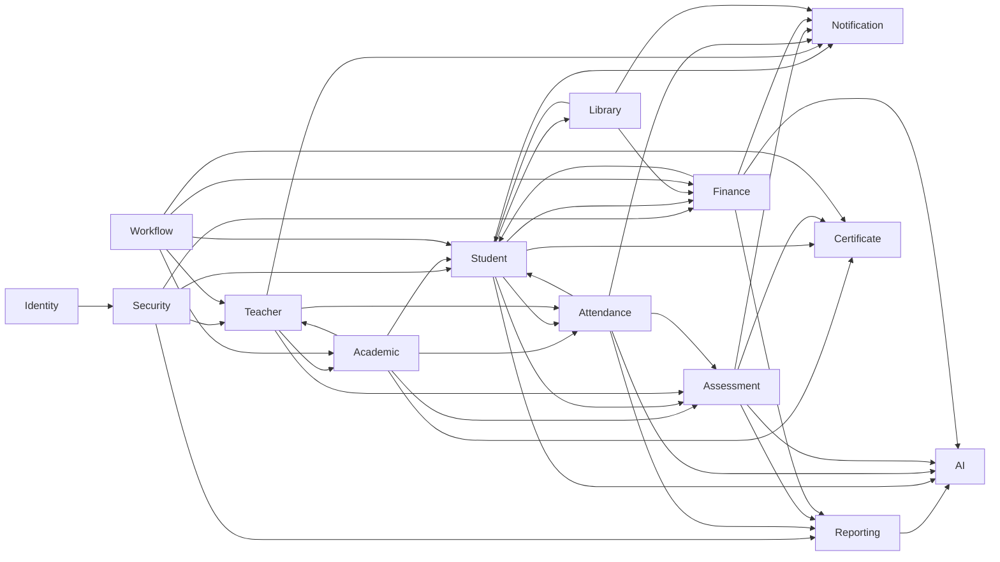
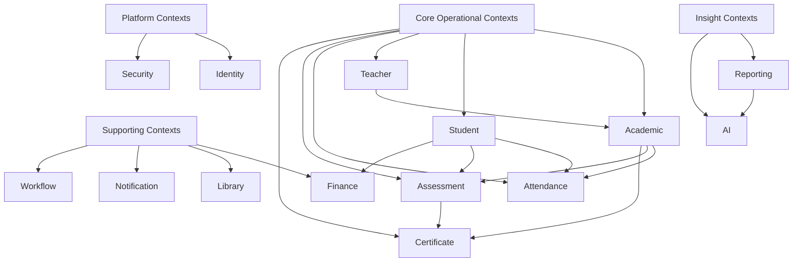
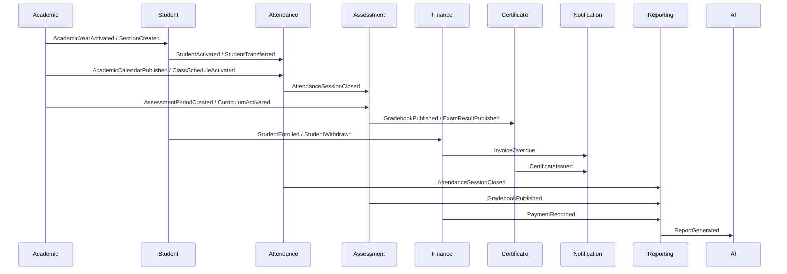

# Education ERP Bounded Context Map

**Phase:** 3.1 - Bounded Context Mapping  
**Status:** Official integration architecture  
**Scope:** Education ERP Platform  
**Rule:** Architecture only. No implementation, service split, repository wiring, SQL, UI, or code generation.

## 1. Purpose

This document defines the official Domain Map for the Education ERP Platform. It identifies bounded contexts, ownership, public contracts, event flows, shared kernel boundaries, anti-corruption requirements, integration rules, dependency matrix, and future microservice candidates.

All future domains must follow the Student Domain standard and must integrate through published contracts, application services, and domain events. Direct repository access across contexts is forbidden.

## 2. Integration Principles

- Each bounded context owns its own model, aggregate roots, repository contracts, and invariants.
- No context may call another context's repository directly.
- Cross-context writes must go through application services or commands exposed as published contracts.
- Cross-context reads must use published query contracts, read models, or projections.
- Cross-context notifications must use domain events or integration events.
- Events are past-tense facts and must not expose internal persistence records.
- Each context may keep local projections of external data.
- External projections are eventually consistent unless an explicit application service contract states otherwise.
- Shared Kernel must be small, stable, and versioned.
- Anti-Corruption Layers are mandatory when consuming external, legacy, ministry, or AI-generated models.

## 3. Relationship Types

| Relationship Type | Meaning | Platform Rule |
|---|---|---|
| Customer/Supplier | Upstream context supplies model/events used by downstream context | Supplier must publish stable contracts and deprecation policy |
| Conformist | Downstream adopts upstream vocabulary without translation | Allowed only for stable core references such as IDs/status codes |
| Shared Kernel | Contexts share a small common model | Must be limited to IDs, date/time primitives, money, audit metadata, and event envelope |
| Partnership | Contexts co-evolve a workflow | Requires joint versioning and test scenarios |
| Open Host Service | Context exposes stable APIs/application services | Required for high-value cross-context operations |
| Published Language | Context publishes DTOs/events/read contracts | Required for all cross-context integration |
| Anti-Corruption Layer | Context translates external or incompatible models | Required for legacy modules, ministry integrations, AI outputs, and external providers |

## 4. Context Map Overview

## 5. Layered Dependency View

## 6. Shared Kernel

Shared Kernel must remain small and stable.

Allowed:

- `SchoolScopeId`
- `TenantId`
- `UserId`
- `StudentId`
- `TeacherId`
- `AcademicYearId`
- `AcademicTermId`
- `GradeLevelId`
- `SectionId`
- `SubjectId`
- `Money`
- `DateRange`
- `TimeRange`
- `Percentage`
- `AuditMetadata`
- `DomainEventEnvelope`
- `Pagination`
- `SortOrder`

Not allowed:

- Aggregate roots.
- Repository interfaces.
- Persistence records.
- UI DTOs.
- Business policies.
- Workflow state machines owned by a specific context.

## 7. Bounded Context Catalog

### 7.1 Academic

Purpose: Own academic structure, calendar, curriculum, course assignments, teaching loads, and class schedules.

Owner: Academic Affairs / School Administration.

Aggregate Roots:

- `AcademicYear`
- `AcademicStructure`
- `Curriculum`
- `CourseAssignment`
- `AcademicCalendar`
- `ClassSchedule`

Public Contracts:

- `IAcademicYearRepository`
- `IAcademicReadRepository`
- `IScheduleReadRepository`
- `AcademicYearDto`
- `AcademicCalendarDto`
- `ClassScheduleDto`
- `GetActiveAcademicYearQuery`
- `GetActiveScheduleQuery`
- `ValidateAcademicPlacementCommand`

Events Published:

- `AcademicYearActivated`
- `AcademicYearClosed`
- `AcademicYearArchived`
- `AcademicTermOpened`
- `AcademicTermClosed`
- `AssessmentPeriodCreated`
- `SectionCreated`
- `SectionCapacityChanged`
- `CurriculumActivated`
- `SubjectAssignedToGradeLevel`
- `CourseAssignmentActivated`
- `AcademicCalendarPublished`
- `HolidayCreated`
- `ClassScheduleActivated`

Events Consumed:

- `TeacherActivated`
- `TeacherSuspended`
- `StudentEnrolled`
- `AssessmentPeriodClosed`

Shared Kernel:

- `SchoolScopeId`, `AcademicYearId`, `AcademicTermId`, `GradeLevelId`, `SectionId`, `SubjectId`, `TeacherId`, `DateRange`, `TimeRange`.

Anti-Corruption Layer Requirements:

- Ministry curriculum templates.
- Legacy master-data class/section records.
- External timetable imports.

### 7.2 Student

Purpose: Own student identity, lifecycle, guardianship links, enrollment state, and student profile boundary.

Owner: Registrar / Student Affairs.

Aggregate Roots:

- `Student`

Public Contracts:

- `IStudentRepository`
- `IStudentReadRepository`
- `IEnrollmentRepository`
- `IGuardianRepository`
- `StudentDto`
- `EnrollmentDto`
- `RegisterStudentCommand`
- `EnrollStudentCommand`
- `TransferStudentCommand`
- `GetStudentByIdQuery`
- `SearchStudentsQuery`

Events Published:

- `StudentRegistered`
- `StudentEnrolled`
- `StudentActivated`
- `StudentTransferred`
- `StudentSuspended`
- `StudentReactivated`
- `StudentGraduated`
- `StudentWithdrawn`
- `StudentArchived`
- `GuardianAssigned`
- `GuardianRemoved`

Events Consumed:

- `AcademicYearActivated`
- `SectionCapacityChanged`
- `ClassScheduleActivated`
- `InvoiceOverdue`
- `CertificateIssued`

Shared Kernel:

- `StudentId`, `AcademicYearId`, `AcademicTermId`, `GradeLevelId`, `SectionId`, `UserId`, `AuditMetadata`.

Anti-Corruption Layer Requirements:

- Legacy `students` module.
- External admission imports.
- Ministry student registry.

### 7.3 Teacher

Purpose: Own teacher identity, employment teaching profile, qualifications, assignment eligibility, and availability preferences.

Owner: HR / Academic Affairs.

Aggregate Roots:

- `Teacher`
- `TeacherQualification`
- `TeacherAvailability`

Public Contracts:

- `ITeacherRepository`
- `ITeacherReadRepository`
- `TeacherDto`
- `TeacherAvailabilityDto`
- `ActivateTeacherCommand`
- `UpdateTeacherQualificationCommand`
- `SearchTeachersQuery`

Events Published:

- `TeacherRegistered`
- `TeacherActivated`
- `TeacherSuspended`
- `TeacherQualificationAdded`
- `TeacherAvailabilityChanged`
- `TeacherArchived`

Events Consumed:

- `CourseAssignmentActivated`
- `TeachingLoadExceeded`
- `ClassScheduleActivated`

Shared Kernel:

- `TeacherId`, `UserId`, `SubjectId`, `SchoolScopeId`.

Anti-Corruption Layer Requirements:

- Legacy teacher module.
- HR/payroll provider imports.
- Ministry teacher registry.

### 7.4 Attendance

Purpose: Own student and teacher attendance records across school days, periods, sections, and schedules.

Owner: Attendance Office / Academic Affairs.

Aggregate Roots:

- `AttendanceSession`
- `StudentAttendanceRecord`
- `TeacherAttendanceRecord`

Public Contracts:

- `IAttendanceSessionRepository`
- `IAttendanceReadRepository`
- `OpenAttendanceSessionCommand`
- `MarkStudentAttendanceCommand`
- `CloseAttendanceSessionCommand`
- `AttendanceSummaryDto`
- `GetAttendanceByStudentQuery`

Events Published:

- `AttendanceSessionOpened`
- `StudentAttendanceMarked`
- `AttendanceSessionClosed`
- `StudentAbsenceDetected`
- `TeacherAbsenceDetected`

Events Consumed:

- `StudentActivated`
- `StudentTransferred`
- `StudentWithdrawn`
- `AcademicCalendarPublished`
- `HolidayCreated`
- `ClassScheduleActivated`
- `CourseAssignmentActivated`

Shared Kernel:

- `StudentId`, `TeacherId`, `SchoolDayId`, `TeachingPeriodId`, `ScheduleSlotId`, `AcademicYearId`, `SectionId`.

Anti-Corruption Layer Requirements:

- Biometric/RFID devices.
- Offline attendance capture clients.
- Legacy attendance tables.

### 7.5 Assessment

Purpose: Own assessment definitions, marks, grading workflows, exam results, and academic performance records.

Owner: Academic Affairs / Examination Office.

Aggregate Roots:

- `AssessmentPlan`
- `AssessmentRecord`
- `Gradebook`
- `ExamResult`

Public Contracts:

- `IAssessmentPlanRepository`
- `IGradebookRepository`
- `IAssessmentReadRepository`
- `CreateAssessmentPlanCommand`
- `RecordAssessmentScoreCommand`
- `PublishGradebookCommand`
- `AssessmentResultDto`
- `GetStudentResultsQuery`

Events Published:

- `AssessmentPlanCreated`
- `AssessmentScoreRecorded`
- `GradebookPublished`
- `ExamResultPublished`
- `StudentFailedSubject`
- `StudentPassedSubject`

Events Consumed:

- `StudentActivated`
- `StudentTransferred`
- `AcademicTermOpened`
- `AcademicTermClosed`
- `CurriculumActivated`
- `SubjectAssignedToGradeLevel`
- `AssessmentPeriodCreated`
- `AttendanceSessionClosed`

Shared Kernel:

- `StudentId`, `SubjectId`, `AcademicYearId`, `AcademicTermId`, `AssessmentPeriodId`, `Percentage`.

Anti-Corruption Layer Requirements:

- External exam imports.
- Ministry grade exports/imports.
- Spreadsheet-based marks.

### 7.6 Certificate

Purpose: Own certificate eligibility, issuance, transcript snapshots, certificate numbering, and official document lifecycle.

Owner: Registrar / Academic Affairs.

Aggregate Roots:

- `Certificate`
- `Transcript`
- `CertificateBatch`

Public Contracts:

- `ICertificateRepository`
- `ICertificateReadRepository`
- `IssueCertificateCommand`
- `VoidCertificateCommand`
- `GenerateTranscriptCommand`
- `CertificateDto`
- `TranscriptDto`

Events Published:

- `CertificateIssued`
- `CertificateVoided`
- `TranscriptGenerated`
- `CertificateBatchClosed`

Events Consumed:

- `StudentGraduated`
- `GradebookPublished`
- `ExamResultPublished`
- `AcademicTermClosed`
- `AcademicYearClosed`

Shared Kernel:

- `StudentId`, `AcademicYearId`, `AcademicTermId`, `GradeLevelId`, `SubjectId`, `Percentage`.

Anti-Corruption Layer Requirements:

- Ministry certificate templates.
- External print/signature providers.
- Historical transcript imports.

### 7.7 Finance

Purpose: Own student billing, fee schedules, invoices, payments, discounts, refunds, and financial account state.

Owner: Finance Office.

Aggregate Roots:

- `StudentAccount`
- `FeeSchedule`
- `Invoice`
- `Payment`
- `Discount`
- `Refund`

Public Contracts:

- `IStudentAccountRepository`
- `IInvoiceRepository`
- `IFinanceReadRepository`
- `CreateInvoiceCommand`
- `RecordPaymentCommand`
- `ApplyDiscountCommand`
- `StudentBalanceDto`
- `GetStudentBalanceQuery`

Events Published:

- `FeeSchedulePublished`
- `InvoiceIssued`
- `PaymentRecorded`
- `DiscountApplied`
- `InvoiceOverdue`
- `StudentBalanceChanged`
- `RefundIssued`

Events Consumed:

- `StudentRegistered`
- `StudentEnrolled`
- `StudentWithdrawn`
- `StudentGraduated`
- `LibraryFineAssessed`

Shared Kernel:

- `StudentId`, `AcademicYearId`, `Money`, `DateRange`, `AuditMetadata`.

Anti-Corruption Layer Requirements:

- Payment gateways.
- Accounting exports.
- Legacy financial module.

### 7.8 Library

Purpose: Own catalog items, borrowing, returns, reservations, fines, and library member state.

Owner: Library Office.

Aggregate Roots:

- `LibraryItem`
- `Borrowing`
- `Reservation`
- `LibraryMember`
- `LibraryFine`

Public Contracts:

- `ILibraryItemRepository`
- `IBorrowingRepository`
- `ILibraryReadRepository`
- `BorrowItemCommand`
- `ReturnItemCommand`
- `ReserveItemCommand`
- `LibraryMemberDto`
- `GetBorrowingHistoryQuery`

Events Published:

- `LibraryItemAdded`
- `ItemBorrowed`
- `ItemReturned`
- `ItemOverdue`
- `LibraryFineAssessed`
- `ReservationCreated`

Events Consumed:

- `StudentActivated`
- `StudentArchived`
- `TeacherActivated`
- `TeacherArchived`
- `PaymentRecorded`

Shared Kernel:

- `StudentId`, `TeacherId`, `Money`, `DateRange`.

Anti-Corruption Layer Requirements:

- Barcode/RFID catalog systems.
- External library catalog import.
- Legacy library records.

### 7.9 Identity

Purpose: Own user accounts, credentials, sessions, authentication providers, identity lifecycle, and identity links.

Owner: Platform Administration / IT.

Aggregate Roots:

- `UserAccount`
- `IdentityProfile`
- `Session`
- `Credential`

Public Contracts:

- `IAuthProvider`
- `IIdentityRepository`
- `AuthenticateCommand`
- `CreateUserAccountCommand`
- `LinkDomainIdentityCommand`
- `UserIdentityDto`
- `CurrentUserQuery`

Events Published:

- `UserAccountCreated`
- `UserAuthenticated`
- `UserLocked`
- `UserRoleAssigned`
- `DomainIdentityLinked`
- `SessionRevoked`

Events Consumed:

- `StudentRegistered`
- `TeacherRegistered`
- `StaffArchived`

Shared Kernel:

- `UserId`, `TenantId`, `SchoolScopeId`, `AuditMetadata`.

Anti-Corruption Layer Requirements:

- SSO providers.
- OAuth/OpenID providers.
- Legacy users table.

### 7.10 Notification

Purpose: Own notification templates, delivery preferences, message dispatch, delivery status, and channel routing.

Owner: Operations / Communications.

Aggregate Roots:

- `NotificationTemplate`
- `NotificationMessage`
- `DeliveryAttempt`
- `NotificationPreference`

Public Contracts:

- `INotificationService`
- `INotificationRepository`
- `SendNotificationCommand`
- `UpdateNotificationPreferenceCommand`
- `NotificationMessageDto`
- `GetNotificationStatusQuery`

Events Published:

- `NotificationQueued`
- `NotificationSent`
- `NotificationFailed`
- `NotificationDelivered`
- `NotificationPreferenceChanged`

Events Consumed:

- `StudentAbsenceDetected`
- `InvoiceOverdue`
- `GradebookPublished`
- `CertificateIssued`
- `WorkflowTaskAssigned`
- `LibraryFineAssessed`

Shared Kernel:

- `StudentId`, `TeacherId`, `UserId`, `AuditMetadata`.

Anti-Corruption Layer Requirements:

- SMS providers.
- Email providers.
- Push notification gateways.
- WhatsApp or local messaging providers.

### 7.11 Workflow

Purpose: Own approvals, tasks, stateful business processes, escalations, and human-in-the-loop coordination.

Owner: Operations / Administration.

Aggregate Roots:

- `WorkflowInstance`
- `WorkflowDefinition`
- `WorkflowTask`
- `ApprovalRequest`

Public Contracts:

- `IWorkflowRepository`
- `IWorkflowReadRepository`
- `StartWorkflowCommand`
- `ApproveTaskCommand`
- `RejectTaskCommand`
- `WorkflowTaskDto`
- `GetPendingTasksQuery`

Events Published:

- `WorkflowStarted`
- `WorkflowTaskAssigned`
- `WorkflowTaskApproved`
- `WorkflowTaskRejected`
- `WorkflowCompleted`
- `WorkflowEscalated`

Events Consumed:

- `StudentRegistered`
- `TransferRequested`
- `CertificateRequested`
- `RefundRequested`
- `CurriculumApprovalRequested`
- `SchedulePublicationRequested`

Shared Kernel:

- `UserId`, `SchoolScopeId`, `AuditMetadata`.

Anti-Corruption Layer Requirements:

- External approval systems.
- Legacy manual approval records.
- Ministry workflow requirements.

### 7.12 Security

Purpose: Own permissions, roles, access policies, audit-sensitive authorization decisions, and security events.

Owner: IT Security / Platform Administration.

Aggregate Roots:

- `Role`
- `PermissionSet`
- `AccessPolicy`
- `SecurityAudit`

Public Contracts:

- `IPermissionProvider`
- `ISecurityPolicyRepository`
- `AuthorizeActionCommand`
- `AssignRoleCommand`
- `PermissionDto`
- `GetUserPermissionsQuery`

Events Published:

- `RoleCreated`
- `PermissionGranted`
- `PermissionRevoked`
- `AccessDenied`
- `SecurityPolicyChanged`
- `SecurityAuditRecorded`

Events Consumed:

- `UserAccountCreated`
- `UserRoleAssigned`
- `DomainIdentityLinked`
- `WorkflowTaskAssigned`

Shared Kernel:

- `UserId`, `TenantId`, `SchoolScopeId`, `AuditMetadata`.

Anti-Corruption Layer Requirements:

- External IAM.
- Legacy role/permission structures.
- Ministry or district role definitions.

### 7.13 Reporting

Purpose: Own operational reports, dashboards, exports, read projections, analytics-ready snapshots, and cross-domain reporting models.

Owner: Administration / Data Office.

Aggregate Roots:

- `ReportDefinition`
- `ReportRun`
- `Dashboard`
- `ExportJob`

Public Contracts:

- `IReportingReadRepository`
- `IReportDefinitionRepository`
- `RunReportCommand`
- `ScheduleReportCommand`
- `DashboardDto`
- `ReportResultDto`

Events Published:

- `ReportGenerated`
- `ReportFailed`
- `DashboardRefreshed`
- `ExportCompleted`

Events Consumed:

- `StudentRegistered`
- `StudentEnrolled`
- `AcademicYearActivated`
- `AttendanceSessionClosed`
- `GradebookPublished`
- `PaymentRecorded`
- `CertificateIssued`

Shared Kernel:

- `SchoolScopeId`, `AcademicYearId`, `DateRange`, `Pagination`, `AuditMetadata`.

Anti-Corruption Layer Requirements:

- BI tools.
- Spreadsheet exports/imports.
- Ministry reports.
- Historical denormalized data.

### 7.14 AI

Purpose: Own AI insight requests, recommendations, predictions, assistant interactions, model outputs, and human review of AI-generated suggestions.

Owner: Data Office / AI Governance.

Aggregate Roots:

- `AIInsightRequest`
- `AIRecommendation`
- `RiskPrediction`
- `AssistantConversation`
- `ModelRun`

Public Contracts:

- `IAIInsightRepository`
- `IAIReadRepository`
- `RequestStudentRiskInsightCommand`
- `RequestAcademicInsightCommand`
- `ApproveAIRecommendationCommand`
- `AIInsightDto`
- `GetAIInsightsQuery`

Events Published:

- `AIInsightRequested`
- `AIInsightGenerated`
- `AIRecommendationCreated`
- `AIRecommendationApproved`
- `AIRecommendationRejected`
- `RiskPredictionUpdated`

Events Consumed:

- `AttendanceSessionClosed`
- `GradebookPublished`
- `StudentAbsenceDetected`
- `InvoiceOverdue`
- `ReportGenerated`
- `WorkflowCompleted`

Shared Kernel:

- `StudentId`, `TeacherId`, `AcademicYearId`, `SchoolScopeId`, `AuditMetadata`.

Anti-Corruption Layer Requirements:

- LLM providers.
- Embedding/vector stores.
- External analytics providers.
- Prompt/output validation and safety filters.

## 8. Context Relationships

| Upstream | Downstream | Relationship | Integration Style | Notes |
|---|---|---|---|---|
| Academic | Student | Customer/Supplier | Published Language, OHS | Student conforms to academic structure IDs |
| Academic | Attendance | Customer/Supplier | Events, Read Contracts | Attendance consumes school days, periods, schedules |
| Academic | Assessment | Customer/Supplier | Events, Read Contracts | Assessment consumes terms, subjects, windows |
| Academic | Certificate | Customer/Supplier | Events, Read Contracts | Certificates consume official structure |
| Teacher | Academic | Partnership | Application Services, Events | Assignments require teacher eligibility |
| Student | Attendance | Customer/Supplier | Events | Attendance tracks active enrolled students |
| Student | Assessment | Customer/Supplier | Events | Assessment tracks eligible students |
| Student | Finance | Customer/Supplier | Events | Finance opens/updates accounts from lifecycle events |
| Student | Library | Customer/Supplier | Events | Library membership follows student lifecycle |
| Assessment | Certificate | Customer/Supplier | Published Language, Events | Certificates require final results |
| Attendance | Assessment | Partnership | Events, Projections | Attendance may affect assessment eligibility |
| Finance | Student | Customer/Supplier | Events | Student may display balance/holds, without owning finance |
| Library | Finance | Customer/Supplier | Events | Library fines become financial charges |
| Identity | Security | Customer/Supplier | OHS, Events | Security consumes authenticated identities |
| Identity | Student | Customer/Supplier | OHS, Events | Student links user identities |
| Identity | Teacher | Customer/Supplier | OHS, Events | Teacher links user identities |
| Security | All Contexts | Open Host Service | Authorization Contracts | All commands must authorize actions |
| Workflow | Student | Partnership | Commands, Events | Enrollment, transfer, certificate requests may need approvals |
| Workflow | Academic | Partnership | Commands, Events | Schedule/curriculum publication may need approval |
| Workflow | Finance | Partnership | Commands, Events | Refunds/discounts may need approval |
| Notification | All Contexts | Open Host Service | Commands, Events | Contexts request notification dispatch |
| Reporting | All Contexts | Conformist / Published Language | Events, Projections | Reporting conforms to published read/event contracts |
| AI | Reporting | Customer/Supplier | ACL, Read Contracts | AI consumes reporting snapshots through ACL |
| AI | Student/Attendance/Assessment/Finance | Anti-Corruption Layer | Events, Projections | AI cannot mutate operational aggregates directly |
| AI | Workflow | Customer/Supplier | Events | AI consumes workflow completion signals |
| Student | Certificate | Customer/Supplier | Events | Student completion drives certificates; certificate issuance notifies the student record |

## 9. Context Dependency Matrix

Legend:

- `O` Owns source of truth.
- `P` Publishes contracts/events.
- `C` Consumes contracts/events.
- `S` Shared Kernel only.
- `ACL` Requires anti-corruption layer.
- `-` No direct dependency.

| Context | Academic | Student | Teacher | Attendance | Assessment | Certificate | Finance | Library | Identity | Notification | Workflow | Security | Reporting | AI |
|---|---|---|---|---|---|---|---|---|---|---|---|---|---|---|
| Academic | O | C | C | P | P | P | - | - | S | P | C | C | P | - |
| Student | C | O | - | P | P | P/C | P/C | P | C | P | C | C | P | - |
| Teacher | C | - | O | P | P | - | - | P | C | P | C | C | P | - |
| Attendance | C | C | C | O | P | - | - | - | S | P | C | C | P | P |
| Assessment | C | C | C | C | O | P | - | - | S | P | C | C | P | P |
| Certificate | C | C | - | - | C | O | - | - | S | P | C | C | P | - |
| Finance | C | C | - | - | - | - | O | C | S | P | C | C | P | P |
| Library | - | C | C | - | - | - | P | O | S | P | C | C | P | - |
| Identity | S | P/C | P/C | - | - | - | - | - | O | P | C | P | P | - |
| Notification | - | C | C | C | C | C | C | C | S | O | C | C | P | - |
| Workflow | C | C | C | - | C | C | C | - | C | P | O | C | P | P |
| Security | S | C | C | C | C | C | C | C | C | P | C | O | P | - |
| Reporting | C | C | C | C | C | C | C | C | S | - | C | C | O | P |
| AI | - | ACL | - | ACL | ACL | - | ACL | - | - | - | C | - | ACL | O |

## 10. Integration Rules

### 10.1 Forbidden

- Direct imports from another context's infrastructure layer.
- Direct calls to another context's repository.
- Sharing aggregate instances across contexts.
- Updating another context's tables or persistence records.
- Using UI DTOs as domain integration contracts.
- AI-generated output directly mutating operational aggregates.

### 10.2 Allowed

- Calling another context's application service when a synchronous decision is required.
- Consuming another context's published read contract.
- Reacting to another context's domain or integration event.
- Maintaining a local projection of another context's public event stream.
- Sharing stable IDs and primitive value objects from Shared Kernel.
- Using ACL translators for external or legacy models.

### 10.3 Synchronous Integration

Use synchronous application service contracts only when the caller needs an immediate decision:

- Authorization decisions.
- Identity authentication.
- Academic placement validation.
- Teacher eligibility checks.
- Payment gateway confirmation.
- Workflow task approval.

### 10.4 Asynchronous Integration

Use events for lifecycle propagation and projection updates:

- Student lifecycle changes.
- Academic calendar publication.
- Schedule activation.
- Attendance closure.
- Assessment result publication.
- Invoice/payment changes.
- Certificate issuance.
- Notification delivery status.

## 11. Published Language

Each context must publish:

- Commands for supported write use cases.
- Queries for supported read use cases.
- DTOs for application-facing data.
- Domain events for meaningful changes.
- Read models for projection-based integration.
- Error codes for contract-level failures.

Published contracts must be versioned when breaking changes are introduced.

## 12. Anti-Corruption Layer Standards

ACLs must:

- Translate foreign IDs into local value objects.
- Normalize external status vocabularies.
- Validate external payloads before domain use.
- Protect domain aggregates from incomplete or unsafe data.
- Map external errors into application errors.
- Log rejected translations with audit metadata.

ACLs are mandatory for:

- Legacy modules.
- Ministry systems.
- Payment gateways.
- SMS/email/push providers.
- Biometric/RFID devices.
- Spreadsheet imports.
- AI/LLM outputs.

## 13. Event Flow Diagram

## 14. Natural Future Microservice Boundaries

Do not split services now. These are natural future boundaries only:

| Future Boundary | Candidate Contexts | Reason |
|---|---|---|
| Academic Operations Service | Academic, Teacher assignment subset | High cohesion around structure, calendar, schedules |
| Student Affairs Service | Student, guardian/profile workflows | Strong lifecycle and registrar ownership |
| Attendance Service | Attendance | High write volume and offline capture |
| Assessment Service | Assessment, Certificate | Exam/result workflows and certificate eligibility |
| Finance Service | Finance | Transactional financial boundary and gateway integration |
| Library Service | Library | Independent catalog/borrowing workflow |
| Identity and Security Service | Identity, Security | Platform authentication and authorization |
| Communication Service | Notification | Provider integration and delivery queues |
| Workflow Service | Workflow | Cross-domain approval engine |
| Reporting and AI Service | Reporting, AI | Read-heavy analytics and model operations |

Splitting criteria:

- Independent deployment need.
- Separate data ownership.
- High scaling pressure.
- External integration risk.
- Distinct operational owner.
- Stable published contracts.

## 15. Governance Rules

- Every new context must be added to this map before implementation.
- Every cross-context dependency must declare relationship type.
- Every integration must have an owning public contract.
- Every event consumer must tolerate missing, duplicate, or out-of-order events.
- Every context must maintain its own tests and focused verification.
- Context map changes require architecture review.
- Student Domain remains the reference implementation for standards.

## 16. Certification Checklist

A context is integration-certified when:

- Purpose and owner are documented.
- Aggregate roots are listed.
- Public contracts are listed.
- Published and consumed events are listed.
- Shared Kernel usage is explicit.
- ACL requirements are explicit.
- Relationship type with other contexts is defined.
- No direct repository access crosses boundaries.
- Integration tests or contract tests are planned.

## 17. Revision Notes (Phase 3.1 Review)

Documentation-only corrections applied during the Phase 3.1 Bounded Context review:

- **Academic published events:** Added `AcademicYearClosed`, `AcademicYearArchived`, and `AssessmentPeriodCreated` to align the Academic context with the Academic Domain Official Architecture and to resolve orphaned consumers (`AcademicYearClosed` is consumed by Certificate; `AssessmentPeriodCreated` is consumed by Assessment).
- **Context Relationships:** Added the missing `Student | Certificate` relationship (certificate issuance notifies the student record) and the `AI | Workflow` relationship (AI consumes `WorkflowCompleted`).
- **Context Dependency Matrix — Student row:** Certificate column changed from `P` to `P/C` because Student consumes `CertificateIssued` while also publishing lifecycle events to Certificate.
- **Context Dependency Matrix — AI row:** The blanket `ACL` was narrowed to only the contexts AI genuinely integrates with (Student, Attendance, Assessment, Finance, Reporting). `C` marks AI consumption of Workflow completion events. Non-integrated contexts are now `-`.
- **Context Dependency Matrix — AI column:** Removed the blanket `P` from contexts that do not publish events consumed by AI (Academic, Student, Teacher, Certificate, Library, Identity, Notification, Security).

No code was modified. Student Domain and Academic Domain documents were not changed.

---

*End of Education ERP Bounded Context Map*

**Next Steps:** Use this document as the official integration architecture for future domain phases.
