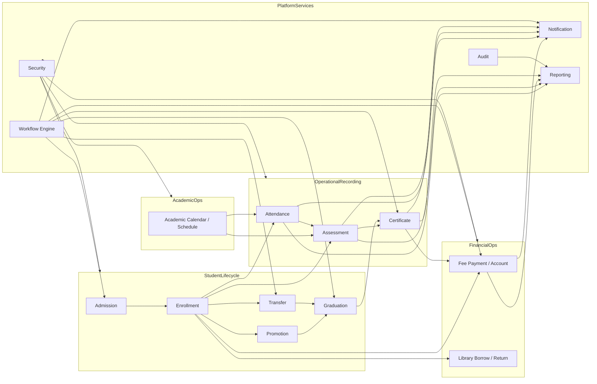
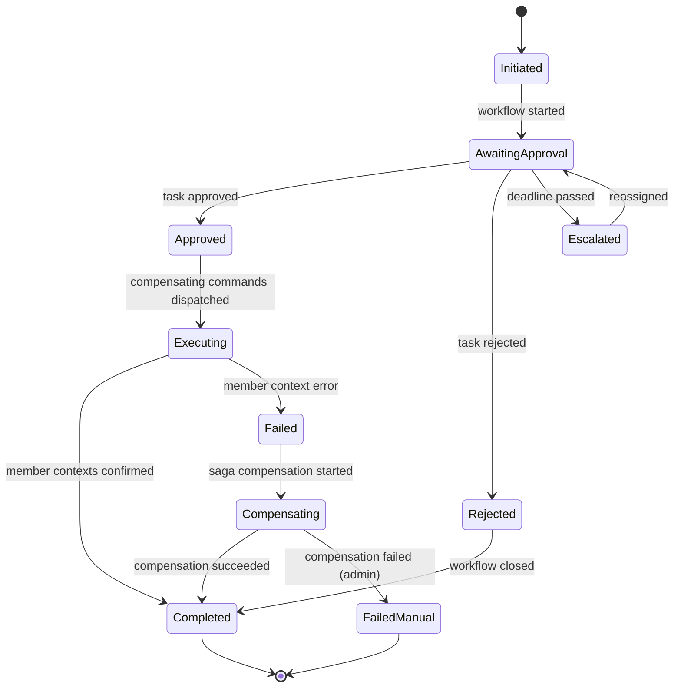
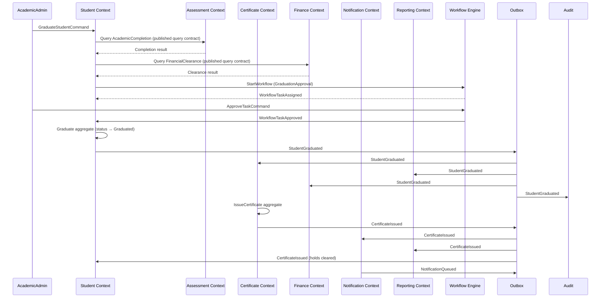
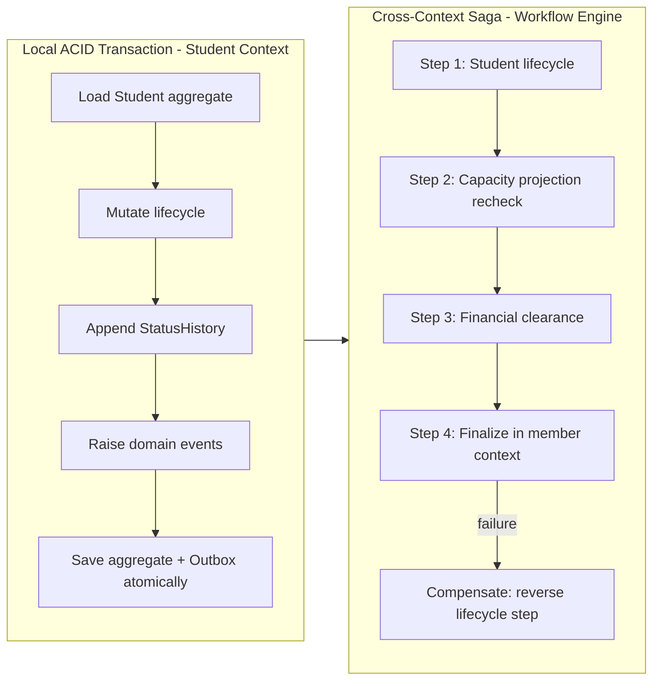
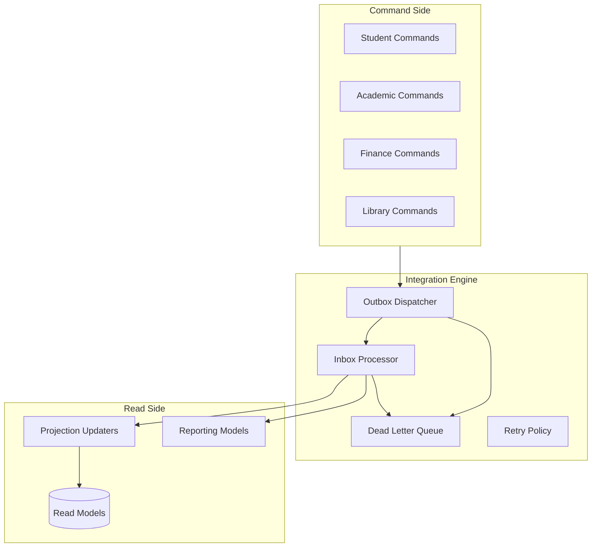

# Enterprise Business Interaction Architecture

**Phase:** 3.2 — Enterprise Business Interaction Architecture
**Status:** Official integration architecture — architecture only
**Scope:** End-to-end business workflows across all bounded contexts of the Education ERP Platform
**Reference standards:**
- `docs/architecture/bounded-context-map.md` (Phase 3.1)
- `docs/architecture/bounded-context-review.md` (Phase 3.1 Review)
- `docs/standards/student-domain-standard.md`
- `docs/domain/student-domain-enterprise-v2.md`
- `docs/domain/academic-domain-official-architecture.md`

**Rule:** Architecture only. No code, no database changes, no UI, no implementation.

---

## 1. Purpose

This document defines how business workflows execute **across** bounded contexts. The Bounded Context Map (Phase 3.1) defined *which* contexts exist and *how* they may integrate. This document defines *what happens end-to-end* when a business operation flows through multiple contexts — admission, enrollment, promotion, transfer, graduation, attendance, assessment, certificate issuing, fee payment, library borrowing, notifications, audit, and reporting.

For every workflow this document defines: business goal, initiating context, initiating command, application service, aggregate, business policies, domain events raised, event consumers, read model updates, transaction boundary, consistency boundary, outbox usage, idempotency strategy, compensation strategy, offline synchronization, error recovery, authorization requirements, and audit requirements.

It also defines the three platform engines (Workflow, Policy, Integration) and the platform-wide cross-cutting contracts (outbox, inbox, idempotency, correlation/causation/trace IDs, audit correlation, retry, dead-letter queue, conflict resolution).

---

## 2. Architectural Principles

1. **Local transaction, global consistency.** Each aggregate changes atomically inside its own context. Cross-context consistency is achieved by events, projections, and sagas — never by distributed locks or cross-context repositories.
2. **Single source of truth per concept.** Each concept is owned by exactly one context (defined in the Bounded Context Map).
3. **Everything crosses boundaries through published contracts.** Commands, queries, DTOs, events, read models. No direct repository access.
4. **Events are facts.** Past-tense, immutable, versioned, idempotent.
5. **Outbox for every write.** Aggregate state and its domain events commit atomically; the dispatcher publishes from the outbox.
6. **Inbox for every consumer.** Consumers record processed events to guarantee exactly-once effect (at-least-once delivery + idempotent processing).
7. **Trace everything.** Every business operation carries correlation ID, causation ID, and distributed trace ID.
8. **Compensate, don't roll back across contexts.** Multi-context workflows use saga-style compensation.
9. **Offline-first.** School-level operations work offline; authoritative operations require sync.
10. **Human-in-the-loop for irreversible decisions.** Graduation, certificate issuance, refunds, and administrative transitions require approvals and audit.

---

## 3. Platform Engines

### 3.1 Workflow Engine

**Owner:** Workflow bounded context.
**Purpose:** Coordinates approvals, tasks, stateful business processes, escalations, and human-in-the-loop decisions across contexts.

**Responsibilities:**
- Maintain workflow definitions and instances (`WorkflowDefinition`, `WorkflowInstance`, `WorkflowTask`, `ApprovalRequest`).
- Start workflows from events or commands (`StartWorkflowCommand`).
- Assign tasks, route approvals, apply deadlines, escalate stalled tasks.
- Publish `WorkflowStarted`, `WorkflowTaskAssigned`, `WorkflowTaskApproved`, `WorkflowTaskRejected`, `WorkflowCompleted`, `WorkflowEscalated`.
- Coordinate saga compensation by invoking compensating commands on member contexts when a workflow fails.
- Keep a durable workflow state that survives process and network failure.

**Boundaries:**
- Does not own business data of other contexts.
- Does not mutate other contexts' aggregates directly — issues commands through published application contracts.
- Consumes lifecycle events (`StudentRegistered`, `TransferRequested`, `CertificateRequested`, `RefundRequested`, `CurriculumApprovalRequested`, `SchedulePublicationRequested`).

**Interaction points:**
- With Student: enrollment, transfer, and certificate request approvals.
- With Academic: schedule/curriculum publication approvals.
- With Finance: refund and discount approvals.
- With Certificate: issuance approvals.
- With Notification: task assignment and completion notifications.
- With Security: authorization on every task action.

### 3.2 Policy Engine

**Owner:** Cross-cutting platform service (per Student Domain Standard policy shape).
**Purpose:** Evaluates composable, deterministic business policies and returns decisions with reasons.

**Responsibilities:**
- Evaluate parent/child policy hierarchies (e.g., `AdmissionPolicy` composes `AgeEligibilityPolicy`, `GuardianPolicy`, `IdentityPolicy`, `DocumentRequirementPolicy`, `CapacityPreCheckPolicy`).
- Return `{ approved: boolean, reasons: DecisionReason[] }` — never mutate aggregates.
- Support policy replacement/reconfiguration without changing aggregate code.
- Record policy evaluation results for audit and decision traceability.
- Expose reusable boolean specifications for eligibility checks.

**Boundaries:**
- Does not persist business data.
- Does not perform I/O; receives all inputs as parameters.
- Each context owns its policy definitions; the engine only evaluates.

**Interaction points:**
- Injected into application services (e.g., `StudentAdmissionService`, `StudentGraduationService`, `FinanceApplicationService`).
- Evaluated before aggregate mutation.
- Used by Workflow Engine for approval eligibility pre-checks.

### 3.3 Integration Engine

**Owner:** Platform infrastructure (extends `src/core/events/`, `src/core/contracts/`, `src/core/datasource/`).
**Purpose:** Reliable cross-context and external-system message delivery.

**Responsibilities:**
- Dispatch outbox messages transactionally committed with aggregate state.
- Deliver events to local bus and remote brokers.
- Process inbox messages idempotently per consumer.
- Enforce retry policy, dead-letter quarantine, and replay.
- Propagate correlation ID, causation ID, and distributed trace ID.
- Route external messages through Anti-Corruption Layers (payment gateways, SMS/email/push, ministry, biometric/RFID, AI providers).

**Boundaries:**
- Does not contain business rules.
- Does not interpret event payloads beyond routing metadata.
- ACL translation happens in context infrastructure, not in the engine.

**Interaction points:**
- Between all contexts (event bus).
- Between contexts and external providers (ACL adapters).
- With Reporting for projection update consumption.
- With Security for authorization of published contracts.

---

## 4. Cross-Cutting Contracts

### 4.1 Outbox

Used by: every context that mutates aggregates and publishes events.

| Field | Purpose |
|---|---|
| `outbox_id` | Unique row identity |
| `aggregate_id`, `aggregate_type`, `aggregate_version` | Source aggregate identity/version |
| `event_type` | Fully qualified past-tense event name |
| `event_id` | Unique event identity |
| `payload` | JSON-compatible event body |
| `occurred_at` | When the fact occurred |
| `sequence` | Ordering within aggregate |
| `status` | `pending`, `publishing`, `published`, `failed`, `dead-lettered` |
| `retry_count`, `next_retry_at`, `last_error` | Retry bookkeeping |
| `correlation_id`, `causation_id`, `trace_id` | Tracing |

Rules:
- Writes to aggregate store and outbox are atomic (same local transaction / unit of work).
- Dispatcher marks `published` only after consumer acknowledges (or at-least-once is accepted).
- Events are never deleted; failures move to dead-letter queue.

### 4.2 Inbox

Used by: every event consumer.

| Field | Purpose |
|---|---|
| `inbox_id` | Unique row identity |
| `consumer_id` | Logical consumer (context + handler) |
| `event_id` | Deduplication key |
| `correlation_id`, `causation_id`, `trace_id` | Tracing |
| `status` | `received`, `processing`, `processed`, `failed`, `dead-lettered` |
| `processed_at` | Completion timestamp |
| `retry_count`, `next_retry_at`, `last_error` | Retry bookkeeping |

Rules:
- Unique constraint on `(consumer_id, event_id)`.
- At-least-once delivery; exactly-once effect via idempotent processing.
- Rejected events go to dead-letter queue after max attempts.

### 4.3 Idempotency

| Contract | Rule |
|---|---|
| Command idempotency | Every write command carries `idempotencyKey`; unique constraint prevents duplicate execution |
| Event idempotency | `event_id` unique per outbox and per consumer inbox |
| Projection idempotency | Projections keyed by `(projection_type, aggregate_id, aggregate_version)`; out-of-order/duplicate ignored |
| Identity idempotency | National ID, academic ID, RFID uniqueness enforced via identity registry reservations |

### 4.4 Correlation ID

- Generated at the start of a business operation (root command).
- Propagated to every downstream event, task, message, projection update, and audit record in the operation.
- Example: one `correlation_id` spans `EnrollStudentCommand → StudentEnrolled → AttendanceProjection → FinanceAccountUpdate`.

### 4.5 Causation ID

- Identifies the immediate predecessor event/message that caused the current one.
- Enables event-chain reconstruction and audit of decision propagation.
- Example: `GradebookPublished (causation)` → `ExamResultPublished (causation of certificate eligibility)`.

### 4.6 Distributed Trace ID

- Span identifier across contexts and external providers.
- Ties together logs, events, projections, HTTP calls, and queue operations for a full operation path.
- Stored in every outbox row, inbox row, audit record, and error log.

### 4.7 Audit Correlation

- Audit records carry: `actor_id`, `actor_role`, `tenant_id`, `school_scope_id`, `correlation_id`, `trace_id`, `action`, `result`, `changed_at`, `before/after` snapshots (where relevant).
- Audit records are append-only and tamper-evident.
- Security-sensitive actions (authorization decisions, identity changes, financial changes, certificate actions) require audit even when no domain event is raised.

### 4.8 Retry Policy

| Classification | Behavior |
|---|---|
| Transient error (network, busy, timeout) | Retry with exponential backoff and jitter |
| Consistency conflict (version mismatch, uniqueness) | Retry only if a fresh read could succeed; otherwise surface as conflict |
| Permanent error (invalid payload, schema) | Do not retry; dead-letter immediately with reason |
| Defaults | Initial delay 100 ms, factor 2, max 6 attempts, jitter ±20% |

### 4.9 Dead Letter Queue (DLQ)

- Failed events/messages after max attempts move to DLQ with `last_error`, trace, and full payload.
- DLQ entries require administrative review.
- Replay support: after fixing cause, DLQ entries can be re-dispatched or reprocessed without data loss.
- DLQ never silently discards.

### 4.10 Conflict Resolution

| Conflict Type | Resolution |
|---|---|
| Lifecycle transition conflict | Reject; human/admin resolution required |
| Identity uniqueness conflict (national/academic/RFID) | Reject second identity; client must reassign |
| Capacity conflict (class/section/library) | Reject or queue; re-validate on retry |
| Financial clearance conflict | Pre-check blocks the operation before it starts |
| Independent profile field update | Merge by field if versions do not overlap |
| Duplicate command/event | Ignore via idempotency key |

---

## 5. Diagrams

### 5.1 Business Interaction Diagram

### 5.2 Generic Workflow Diagram (Workflow Engine)

### 5.3 Event Flow Diagram (Graduation → Certificate → Notification → Reporting)

### 5.4 Transaction Boundary Diagram

### 5.5 Context Collaboration Diagram

---

## 6. Workflow Catalog

Each workflow defines 18 attributes. Consistency boundary refers to when the operation is visible and safe across contexts; transaction boundary refers to the local atomic unit.

---

### 6.1 Student Admission

| Field | Definition |
|---|---|
| **Business Goal** | Accept eligible applicants into the school and create the student identity |
| **Initiating Context** | Student |
| **Initiating Command** | `RegisterStudentCommand` (creates Applicant), `AcceptStudentCommand` (approval) |
| **Application Service** | `StudentAdmissionService` |
| **Aggregate** | `Student` (Applicant → Accepted lifecycle) |
| **Business Policies** | `AdmissionPolicy`, `AgeEligibilityPolicy`, `GuardianPolicy`, `IdentityPolicy`, `DocumentRequirementPolicy`, `CapacityPreCheckPolicy` |
| **Domain Events Raised** | `StudentApplicationSubmitted`, `StudentAccepted` |
| **Event Consumers** | Notification, Audit, Identity (user link), Finance (account readiness), Workflow (if approval needed) |
| **Read Model Updates** | `StudentSearchProjection`, `StudentTimelineProjection`, `ApplicantListProjection` |
| **Transaction Boundary** | Student aggregate + outbox, local ACID |
| **Consistency Boundary** | Student identity and status strongly consistent; class/section capacity check is a pre-check (eventually confirmed) |
| **Outbox Usage** | Yes — `StudentApplicationSubmitted`, `StudentAccepted` published via outbox |
| **Idempotency Strategy** | Command `idempotencyKey`; national ID / academic ID reserved via `StudentIdentityRegistry`; duplicate application rejected |
| **Compensation Strategy** | Rejection or withdrawal transitions Applicant → Archived (`StudentApplicationClosed`); no financial side effects to reverse |
| **Offline Synchronization** | Offline application creation with client-generated ID; identity reservation validated on sync; server rejects duplicate identity |
| **Error Recovery** | Retry identity reservation with backoff; dead-letter identity conflicts for admin review |
| **Authorization Requirements** | `student.application.create`, `student.application.review`, `student.application.accept` |
| **Audit Requirements** | Audit application submission, acceptance decision, identity uniqueness decisions, policy evaluation results |

---

### 6.2 Student Enrollment

| Field | Definition |
|---|---|
| **Business Goal** | Assign an accepted student to an academic year, term, class, and section (placement) |
| **Initiating Context** | Student (references Academic structure) |
| **Initiating Command** | `EnrollStudentCommand` |
| **Application Service** | `EnrollmentService` / `StudentRegistrationAppService` |
| **Aggregate** | `Enrollment` (source of truth for placement); `Student` stores `CurrentEnrollmentRef` projection |
| **Business Policies** | `EnrollmentPolicy`, `AcademicCalendarPolicy`, `ClassCapacityPolicy`, `SectionCompatibilityPolicy`, `PaymentPrerequisitePolicy` |
| **Domain Events Raised** | `StudentEnrolled`, `EnrollmentCreated` |
| **Event Consumers** | Attendance, Assessment, Finance, Library, Reporting, Notification, Identity |
| **Read Model Updates** | `StudentCurrentEnrollmentProjection`, `ClassRosterProjection`, `SectionCapacityProjection` |
| **Transaction Boundary** | Enrollment aggregate + outbox local ACID; `Student.currentEnrollmentRef` updated in the same Student-context transaction |
| **Consistency Boundary** | Enrollment record strongly consistent; capacity projections and downstream subscriptions eventually consistent |
| **Outbox Usage** | Yes — `StudentEnrolled` via outbox |
| **Idempotency Strategy** | Command `idempotencyKey`; unique enrollment per student per academic year/term; re-enrollment requires explicit type |
| **Compensation Strategy** | Withdrawal/void of enrollment releases capacity via `EnrollmentWithdrawn`; downstream contexts react |
| **Offline Synchronization** | Offline enrollment command with `expectedVersion`; conflict if capacity or placement changed on server |
| **Error Recovery** | Retry capacity validation; dead-letter capacity conflicts |
| **Authorization Requirements** | `student.enrollment.create`, `student.enrollment.withdraw` |
| **Audit Requirements** | Audit placement creation, placement change, capacity adjustments |

---

### 6.3 Student Promotion

| Field | Definition |
|---|---|
| **Business Goal** | Advance a student to the next grade level at the academic-year boundary |
| **Initiating Context** | Student + Academic |
| **Initiating Command** | `PromoteStudentCommand` |
| **Application Service** | `StudentPromotionService` |
| **Aggregate** | `Enrollment` (new placement record); `Student` (lifecycle reflects promotion) |
| **Business Policies** | `PromotionPolicy`, `AcademicCompletionPolicy`, `AttendanceCompletionPolicy`, `FinancialClearancePolicy` |
| **Domain Events Raised** | `StudentPromoted`, `EnrollmentCompleted`, `EnrollmentCreated` |
| **Event Consumers** | Academic, Attendance, Assessment, Certificate, Reporting, Notification |
| **Read Model Updates** | `GradeRosterProjection`, `StudentTimelineProjection`, `PromotionBatchProjection` |
| **Transaction Boundary** | New Enrollment local ACID; promotion approval runs through Workflow Engine |
| **Consistency Boundary** | Promotion decision eventually consistent across year boundary; grade assignments propagate by event |
| **Outbox Usage** | Yes — `StudentPromoted` via outbox |
| **Idempotency Strategy** | Command `idempotencyKey`; unique promotion per student per academic year |
| **Compensation Strategy** | No auto-reversal; a mistaken promotion is corrected by a new enrollment/promotion with audit trail |
| **Offline Synchronization** | Batch promotion supported offline with expected versions; final grade promotion requires authoritative sync |
| **Error Recovery** | Dead-letter eligibility conflicts; batch partial success is reported with per-student results |
| **Authorization Requirements** | `student.promotion.approve` |
| **Audit Requirements** | Audit promotion decisions, batch results, eligibility evaluation |

---

### 6.4 Student Transfer

| Field | Definition |
|---|---|
| **Business Goal** | Move a student between sections, classes, or schools while preserving history |
| **Initiating Context** | Student |
| **Initiating Command** | `TransferStudentCommand` |
| **Application Service** | `StudentTransferService` |
| **Aggregate** | `Enrollment` (close source, create destination); `Student` (status → Transferred when external) |
| **Business Policies** | `TransferPolicy`, `EnrollmentContinuityPolicy`, `DestinationCapacityPolicy`, `FinancialClearancePolicy`, `DocumentTransferPolicy` |
| **Domain Events Raised** | `StudentTransferred`, `EnrollmentCompleted`, `EnrollmentCreated` |
| **Event Consumers** | Attendance, Assessment, Finance, Library, Academic, Reporting, Notification, Identity |
| **Read Model Updates** | `StudentCurrentEnrollmentProjection`, `SectionRosterProjection`, `TransferHistoryProjection` |
| **Transaction Boundary** | Two local transactions (source close, destination create) coordinated by a saga; approval via Workflow Engine |
| **Consistency Boundary** | Transfer completion eventually consistent; financial clearance pre-check blocks incomplete transfers |
| **Outbox Usage** | Yes — transfer events via outbox |
| **Idempotency Strategy** | Transfer command `idempotencyKey`; unique transfer reference; duplicate transfer commands ignored |
| **Compensation Strategy** | Failed destination capacity → saga compensation closes the destination and keeps source; reversal of a completed transfer is a new reverse transfer with audit |
| **Offline Synchronization** | Offline transfer initiation; approval via Workflow; `expectedVersion` conflict detection on sync |
| **Error Recovery** | Dead-letter destination capacity conflicts; saga retries with backoff |
| **Authorization Requirements** | `student.transfer.request`, `student.transfer.approve` |
| **Audit Requirements** | Audit transfer reason, decision, approval, source/destination placement |

---

### 6.5 Student Graduation

| Field | Definition |
|---|---|
| **Business Goal** | Complete an academic stage and mark the student graduated with certificate eligibility |
| **Initiating Context** | Student + Assessment + Certificate |
| **Initiating Command** | `GraduateStudentCommand` / `ApproveGraduationCommand` |
| **Application Service** | `StudentGraduationService` |
| **Aggregate** | `Student` (status → Graduated); `Certificate` eligibility; `Transcript` |
| **Business Policies** | `GraduationPolicy`, `AcademicCompletionPolicy`, `AttendanceCompletionPolicy`, `FinancialClearancePolicy`, `CertificateEligibilityPolicy` |
| **Domain Events Raised** | `StudentGraduated`, `CertificateEligible`, `TranscriptGenerated` |
| **Event Consumers** | Certificate, Finance, Library, Alumni, Reporting, Notification, Audit |
| **Read Model Updates** | `GraduatedStudentProjection`, `AlumniProjection`, `CertificateEligibilityProjection` |
| **Transaction Boundary** | Graduation lifecycle local ACID; certificate issuance is a separate local transaction in Certificate context |
| **Consistency Boundary** | Graduation status strongly consistent; certificate issuance and alumni records eventually consistent |
| **Outbox Usage** | Yes — `StudentGraduated` via outbox |
| **Idempotency Strategy** | Graduation command `idempotencyKey`; certificate number uniqueness enforced at issuance |
| **Compensation Strategy** | No auto-reversal; a contested graduation requires administrative override with full audit and a compensating status change |
| **Offline Synchronization** | Graduation requires authoritative synchronization (irreversible); not offline-first |
| **Error Recovery** | Dead-letter certificate-number conflicts; replay of eligibility projection from event log |
| **Authorization Requirements** | `student.graduation.approve` |
| **Audit Requirements** | Audit graduation approval, eligibility evaluation, certificate handoff |

---

### 6.6 Attendance Recording

| Field | Definition |
|---|---|
| **Business Goal** | Record student and teacher attendance per school day and period |
| **Initiating Context** | Attendance |
| **Initiating Command** | `OpenAttendanceSessionCommand`, `MarkStudentAttendanceCommand`, `CloseAttendanceSessionCommand` |
| **Application Service** | `AttendanceApplicationService` |
| **Aggregate** | `AttendanceSession`, `StudentAttendanceRecord`, `TeacherAttendanceRecord` |
| **Business Policies** | `AttendanceSessionPolicy`, `AttendanceMarkingPolicy`, `AbsencePolicy` (thresholds) |
| **Domain Events Raised** | `AttendanceSessionOpened`, `StudentAttendanceMarked`, `AttendanceSessionClosed`, `StudentAbsenceDetected`, `TeacherAbsenceDetected` |
| **Event Consumers** | Assessment (eligibility), Reporting, Notification, AI (risk), Student (risk transition), Workflow |
| **Read Model Updates** | `AttendanceSummaryProjection`, `StudentAttendanceProjection`, `DailyAttendanceProjection` |
| **Transaction Boundary** | Per-session close local ACID; absence detection runs after close |
| **Consistency Boundary** | Marks strongly consistent per session; derived absence and eligibility eventually consistent |
| **Outbox Usage** | Yes — `AttendanceSessionClosed`, `StudentAbsenceDetected` via outbox |
| **Idempotency Strategy** | Mark command `idempotencyKey`; unique (student, school day, period); duplicate marks ignored |
| **Compensation Strategy** | Correction = re-mark with reason (no multi-context rollback); absence re-evaluated on correction |
| **Offline Synchronization** | Offline capture (RFID/biometric/offline clients) with device queues; session close requires sync; conflicts by `expectedVersion` |
| **Error Recovery** | Dead-letter device sync conflicts; re-open/re-close session for recovery |
| **Authorization Requirements** | `attendance.session.open`, `attendance.mark`, `attendance.session.close` |
| **Audit Requirements** | Audit marking corrections, session close, absence detection |

---

### 6.7 Assessment Lifecycle

| Field | Definition |
|---|---|
| **Business Goal** | Define assessment plans, record marks, publish gradebooks, and publish results |
| **Initiating Context** | Assessment |
| **Initiating Command** | `CreateAssessmentPlanCommand`, `RecordAssessmentScoreCommand`, `PublishGradebookCommand` |
| **Application Service** | `AssessmentApplicationService` |
| **Aggregate** | `AssessmentPlan`, `AssessmentRecord`, `Gradebook`, `ExamResult` |
| **Business Policies** | `AssessmentPlanPolicy`, `GradebookPolicy`, `ResultPublicationPolicy`, `PassFailPolicy` |
| **Domain Events Raised** | `AssessmentPlanCreated`, `AssessmentScoreRecorded`, `GradebookPublished`, `ExamResultPublished`, `StudentPassedSubject`, `StudentFailedSubject` |
| **Event Consumers** | Certificate, Reporting, Notification, AI, Student, Workflow |
| **Read Model Updates** | `StudentResultProjection`, `GradebookProjection`, `AcademicPerformanceProjection` |
| **Transaction Boundary** | Per-assessment record local ACID; gradebook publish local ACID; certification eventual |
| **Consistency Boundary** | Marks strongly consistent; published results immutable; downstream eligibility eventually consistent |
| **Outbox Usage** | Yes — `GradebookPublished`, `ExamResultPublished` via outbox |
| **Idempotency Strategy** | Score command `idempotencyKey`; unique (student, subject, assessment window) |
| **Compensation Strategy** | Result amendment workflow re-publishes; no auto-rollback of published gradebook |
| **Offline Synchronization** | Offline marks capture with expected versions; gradebook publication requires authoritative sync |
| **Error Recovery** | Dead-letter publication conflicts; replay from outbox for projection rebuild |
| **Authorization Requirements** | `assessment.plan.create`, `assessment.score.record`, `assessment.gradebook.publish` |
| **Audit Requirements** | Audit score changes, gradebook publication, result amendments |

---

### 6.8 Certificate Issuing

| Field | Definition |
|---|---|
| **Business Goal** | Issue official certificates and transcripts upon verified eligibility |
| **Initiating Context** | Certificate |
| **Initiating Command** | `IssueCertificateCommand`, `GenerateTranscriptCommand` |
| **Application Service** | `CertificateApplicationService` |
| **Aggregate** | `Certificate`, `Transcript`, `CertificateBatch` |
| **Business Policies** | `CertificateEligibilityPolicy`, `CertificateNumberingPolicy`, `TranscriptPolicy` |
| **Domain Events Raised** | `CertificateIssued`, `CertificateVoided`, `TranscriptGenerated`, `CertificateBatchClosed` |
| **Event Consumers** | Student, Notification, Reporting, Alumni, Finance |
| **Read Model Updates** | `CertificateRegistryProjection`, `TranscriptProjection` |
| **Transaction Boundary** | Certificate issuance local ACID; numbering uniqueness enforced |
| **Consistency Boundary** | Eligibility strongly consistent at issuance; batch numbering eventually consistent |
| **Outbox Usage** | Yes — `CertificateIssued`, `CertificateVoided` via outbox |
| **Idempotency Strategy** | Certificate number unique; issuance command `idempotencyKey` |
| **Compensation Strategy** | Void certificate (`CertificateVoided`) — never delete; reprint workflow for printing failures |
| **Offline Synchronization** | Issuance requires authoritative sync (numbering, printing); not offline-first |
| **Error Recovery** | Dead-letter numbering conflicts; reprint and void-reissue flows |
| **Authorization Requirements** | `certificate.issue`, `certificate.void` |
| **Audit Requirements** | Audit issuance, void, batch close, printing, signatory actions |

---

### 6.9 Fee Payment

| Field | Definition |
|---|---|
| **Business Goal** | Record payments against invoices and maintain student financial account state |
| **Initiating Context** | Finance |
| **Initiating Command** | `CreateInvoiceCommand`, `RecordPaymentCommand`, `ApplyDiscountCommand`, `IssueRefundCommand` |
| **Application Service** | `FinanceApplicationService` |
| **Aggregate** | `Invoice`, `Payment`, `StudentAccount`, `Discount`, `Refund` |
| **Business Policies** | `InvoicingPolicy`, `PaymentPolicy`, `DiscountPolicy`, `RefundPolicy`, `OverduePolicy` |
| **Domain Events Raised** | `InvoiceIssued`, `PaymentRecorded`, `DiscountApplied`, `InvoiceOverdue`, `StudentBalanceChanged`, `RefundIssued` |
| **Event Consumers** | Student (holds/balance), Library (fine charges), Notification, Reporting, AI, Workflow |
| **Read Model Updates** | `StudentBalanceProjection`, `PaymentLedgerProjection`, `FeeCollectionProjection` |
| **Transaction Boundary** | Payment + account balance local ACID; payment gateway confirmation is synchronous |
| **Consistency Boundary** | Payment strongly consistent; downstream holds/eligibility eventually consistent |
| **Outbox Usage** | Yes — `PaymentRecorded`, `InvoiceOverdue`, `StudentBalanceChanged` via outbox |
| **Idempotency Strategy** | Payment reference `idempotencyKey`; gateway transaction ID unique |
| **Compensation Strategy** | Refund (`RefundIssued`) for overpayment; failed gateway → void/reverse payment; no cross-context rollback |
| **Offline Synchronization** | Offline payment capture with expected versions; gateway operations require sync |
| **Error Recovery** | Dead-letter gateway reconciliation conflicts; reconciliation job matches gateway ledger |
| **Authorization Requirements** | `finance.invoice.create`, `finance.payment.record`, `finance.refund.issue` |
| **Audit Requirements** | Audit payments, discounts, refunds, balance changes, gateway confirmations |

---

### 6.10 Library Borrow / Return

| Field | Definition |
|---|---|
| **Business Goal** | Borrow, return, and reserve library items; assess fines; maintain member state |
| **Initiating Context** | Library |
| **Initiating Command** | `BorrowItemCommand`, `ReturnItemCommand`, `ReserveItemCommand` |
| **Application Service** | `LibraryApplicationService` |
| **Aggregate** | `Borrowing`, `Reservation`, `LibraryItem`, `LibraryMember`, `LibraryFine` |
| **Business Policies** | `BorrowingPolicy`, `LoanLimitPolicy`, `ReturnPolicy`, `FinePolicy`, `ReservationPolicy` |
| **Domain Events Raised** | `ItemBorrowed`, `ItemReturned`, `ItemOverdue`, `LibraryFineAssessed`, `ReservationCreated`, `LibraryItemAdded` |
| **Event Consumers** | Finance (fines), Notification, Student, Teacher, Reporting |
| **Read Model Updates** | `BorrowingHistoryProjection`, `CatalogAvailabilityProjection`, `MemberBalanceProjection` |
| **Transaction Boundary** | Borrowing/return local ACID; fine assessment local ACID |
| **Consistency Boundary** | Borrowing strongly consistent; fine transfer to Finance eventually consistent |
| **Outbox Usage** | Yes — `ItemBorrowed`, `ItemReturned`, `LibraryFineAssessed` via outbox |
| **Idempotency Strategy** | Borrowing command `idempotencyKey`; unique (item copy, member) active loan |
| **Compensation Strategy** | Return clears the loan; overdue → fine assessed; no rollback of a completed loan |
| **Offline Synchronization** | Offline lending with device queues; conflicts on catalog availability resolved by `expectedVersion` |
| **Error Recovery** | Dead-letter item-state conflicts; reconciliation of offline loans on sync |
| **Authorization Requirements** | `library.item.borrow`, `library.item.return`, `library.fine.assess` |
| **Audit Requirements** | Audit borrowing, returns, fines, reservations, item changes |

---

### 6.11 Notification Delivery

| Field | Definition |
|---|---|
| **Business Goal** | Dispatch templated messages via configured channels and track delivery |
| **Initiating Context** | Notification |
| **Initiating Command** | `SendNotificationCommand`, `UpdateNotificationPreferenceCommand` |
| **Application Service** | `NotificationApplicationService` |
| **Aggregate** | `NotificationMessage`, `DeliveryAttempt`, `NotificationPreference`, `NotificationTemplate` |
| **Business Policies** | `NotificationPreferencePolicy`, `ChannelRoutingPolicy`, `DeliveryRetryPolicy` |
| **Domain Events Raised** | `NotificationQueued`, `NotificationSent`, `NotificationFailed`, `NotificationDelivered`, `NotificationPreferenceChanged` |
| **Event Consumers** | External providers (SMS/email/push), Reporting, Audit |
| **Read Model Updates** | `NotificationStatusProjection`, `DeliveryAnalyticsProjection` |
| **Transaction Boundary** | Queue local ACID; provider delivery is asynchronous |
| **Consistency Boundary** | Queued strongly consistent; delivered eventually consistent (provider-dependent) |
| **Outbox Usage** | Yes — `NotificationQueued` via outbox; provider callbacks recorded through inbox |
| **Idempotency Strategy** | Message `idempotencyKey`; identical notification deduplicated per recipient+subject+window |
| **Compensation Strategy** | None (best-effort); failures retried, then dead-lettered |
| **Offline Synchronization** | Offline queued notifications flushed on sync; preferences cached locally |
| **Error Recovery** | Retry with backoff per provider; dead-letter after max attempts; manual resend |
| **Authorization Requirements** | `notification.send`, `notification.preference.update` |
| **Audit Requirements** | Audit send, delivery status, failures, preference changes |

---

### 6.12 Audit Recording

| Field | Definition |
|---|---|
| **Business Goal** | Record security-sensitive actions and state changes immutably |
| **Initiating Context** | Cross-cutting (Security / platform) |
| **Initiating Command** | `RecordAuditEventCommand` (internal service contract) |
| **Application Service** | `AuditService` |
| **Aggregate** | `SecurityAudit` (append-only) |
| **Business Policies** | `AuditRetentionPolicy`, `AuditTamperPolicy` |
| **Domain Events Raised** | `SecurityAuditRecorded` (internal) |
| **Event Consumers** | Security, Reporting |
| **Read Model Updates** | `AuditTrailProjection` |
| **Transaction Boundary** | Local append-only write |
| **Consistency Boundary** | Strong within audit store; audit correlation spans the full operation trace |
| **Outbox Usage** | Optional for cross-node audit correlation; primary write is direct to audit store |
| **Idempotency Strategy** | Unique audit event ID; dedup on retry |
| **Compensation Strategy** | None — append-only; corrections create new audit entries |
| **Offline Synchronization** | Offline audit buffer flushed on sync; never dropped |
| **Error Recovery** | Dead-letter for audit write failures; audit is highest-priority write |
| **Authorization Requirements** | `audit.write` (internal service only), `audit.read` (authorized staff) |
| **Audit Requirements** | Audit is the requirement itself; entries immutable, tamper-evident, correlated |

---

### 6.13 Reporting Projection

| Field | Definition |
|---|---|
| **Business Goal** | Maintain denormalized read models for dashboards, exports, and analytics |
| **Initiating Context** | Reporting |
| **Initiating Command** | `RunReportCommand`, `ScheduleReportCommand`; projection updaters consume events |
| **Application Service** | `ReportingApplicationService` / `ProjectionUpdater` |
| **Aggregate** | `ReportDefinition`, `ReportRun`, `Dashboard`, `ExportJob` |
| **Business Policies** | `ProjectionRefreshPolicy`, `ReportAccessPolicy`, `RetentionPolicy` |
| **Domain Events Raised** | `ReportGenerated`, `ReportFailed`, `DashboardRefreshed`, `ExportCompleted` |
| **Event Consumers** | AI, Notification, Security |
| **Read Model Updates** | `DashboardProjection`, `ReportSnapshot`, `ExportFile` |
| **Transaction Boundary** | Projection update local ACID (idempotent upsert) |
| **Consistency Boundary** | Eventually consistent; rebuildable from outbox/event log |
| **Outbox Usage** | Yes — Reporting is a consumer via inbox; projection writes are idempotent |
| **Idempotency Strategy** | Projection applied by `event_id`; last-writer-wins by `aggregate_version` |
| **Compensation Strategy** | Projection rebuild from event log; no rollback of source contexts |
| **Offline Synchronization** | Local read models cacheable; refresh on sync |
| **Error Recovery** | Rebuild from outbox; dead-letter unprocessable events |
| **Authorization Requirements** | `report.run`, `report.schedule`, `report.export` |
| **Audit Requirements** | Audit report runs, exports, data access |

---

## 7. Consistency and Transaction Model Summary

| Workflow | Transaction Boundary | Consistency Boundary | Saga / Compensation |
|---|---|---|---|
| Admission | Student local | Identity strong; capacity pre-check | Applicant → Archived on rejection |
| Enrollment | Enrollment local | Placement strong; capacity eventual | Withdrawal releases capacity |
| Promotion | Enrollment local + Workflow | Year-boundary eventual | Manual correction |
| Transfer | Two local (source/dest) + saga | Transfer eventual | Close destination on failure |
| Graduation | Student local; Certificate local | Graduation strong; cert eventual | Admin override only |
| Attendance | Session local | Marks strong; absence eventual | Re-mark correction |
| Assessment | Record/Gradebook local | Marks strong; results eventual | Amendment re-publish |
| Certificate | Certificate local | Eligibility strong; numbering eventual | Void (never delete) |
| Fee Payment | Payment local + gateway sync | Payment strong; holds eventual | Refund / void payment |
| Library | Borrow/Return local | Loan strong; fines eventual | Return + fine |
| Notification | Queue local | Queued strong; delivery eventual | Retry → DLQ |
| Audit | Audit store local | Strong | None (append-only) |
| Reporting | Projection local | Eventual; rebuildable | Projection rebuild |

---

## 8. Offline Synchronization Model

| Mode | Workflows | Rules |
|---|---|---|
| Fully offline-capable | Attendance marking, Library borrowing, Notification queue, Audit buffer, Reporting read models | Client-generated IDs, `expectedVersion`, local queues, batch sync |
| Offline with server confirmation | Admission application, Enrollment, Promotion batch, Transfer initiation, Fee capture | Identity/capacity validated on sync; conflicts surfaced |
| Authoritative sync required | Graduation, Certificate issuance, Gradebook publication, Academic year activation, Refund | Irreversible or numbering-critical operations require authoritative server sync |

General rules:
- Every aggregate carries `version`, `lastModifiedAt`, `lastModifiedBy`, `syncVersion`, `deviceId`.
- Commands carry `expectedVersion`; conflicts return explicit conflict results.
- Lifecycle and identity fields are never auto-merged.
- Outbox events are queued locally and published after successful sync.

---

## 9. Security and Authorization Model

- Every command is authorized through the Security context (`AuthorizeActionCommand`, `PermissionDto`).
- Authorization is synchronous (see Bounded Context Map §10.3).
- Workflow task actions require re-authorization at task execution time.
- Sensitive operations (graduation, certificate, refund, identity changes) require elevated permissions and audit.
- External providers and AI outputs pass through ACLs; AI can never directly mutate operational aggregates.

---

## 10. Audit Model

- Every workflow defines audit requirements (Section 6).
- Audit records carry `actor_id`, `actor_role`, `tenant_id`, `school_scope_id`, `correlation_id`, `trace_id`, `action`, `result`, `changed_at`.
- Audit is append-only and tamper-evident.
- Audit is the last step in every saga and the last consumer to acknowledge a business operation's completion.

---

## 11. Error Recovery and Dead Letter Model

- Transient failures: retry with exponential backoff (100 ms → 3.2 s, factor 2, max 6, jitter ±20%).
- Consistency conflicts: re-read and retry only if a fresh read could succeed; otherwise surface as conflict for human resolution.
- Permanent failures: dead-letter immediately with reason and trace.
- DLQ supports replay after remediation without data loss.
- Sagas maintain a durable state so failures resume or compensate after process/network failure.

---

## 12. Certification Checklist

A workflow is certified when all of the following are defined and consistent with the Bounded Context Map:

- [ ] Business goal is stated.
- [ ] Initiating context and command are identified.
- [ ] Application service and aggregates are identified.
- [ ] Business policies are listed and owned.
- [ ] Domain events are past-tense facts and listed.
- [ ] Event consumers are enumerated.
- [ ] Read model updates are enumerated.
- [ ] Transaction boundary is local ACID per aggregate.
- [ ] Consistency boundary is explicit (eventual vs strong).
- [ ] Outbox usage is specified.
- [ ] Idempotency strategy is specified.
- [ ] Compensation strategy is specified (or explicitly none).
- [ ] Offline synchronization behavior is specified.
- [ ] Error recovery is specified.
- [ ] Authorization requirements are specified.
- [ ] Audit requirements are specified.
- [ ] No cross-context repository access exists.
- [ ] No code, database, or UI is implied by this document.

---

## 13. Next Steps

This document approves the business interaction architecture for the Education ERP Platform. Recommended next phase (implementation planning only, still no implementation): **Phase 4.x — Context Implementation Planning**, beginning with the **Academic Domain Skeleton** (per the Academic Domain Official Architecture) and the **Student Domain implementation**, both following the Student Domain Standard and this interaction architecture.

No implementation was performed in this phase.

---

*End of Enterprise Business Interaction Architecture*

