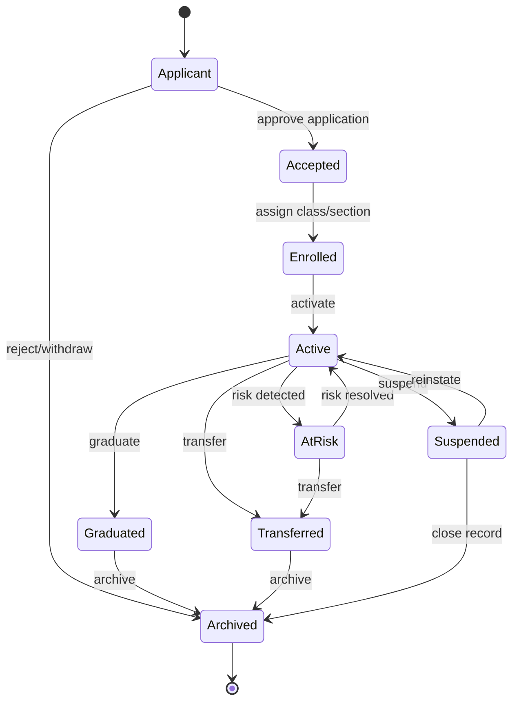
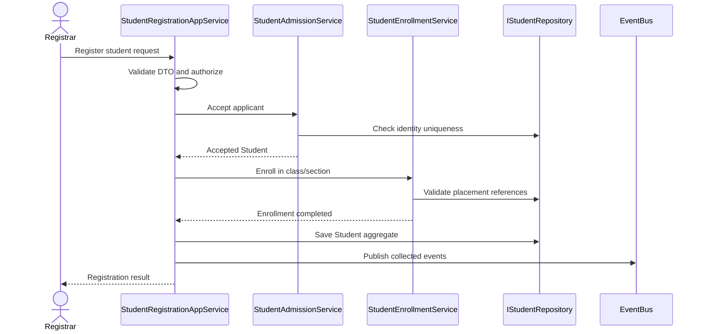
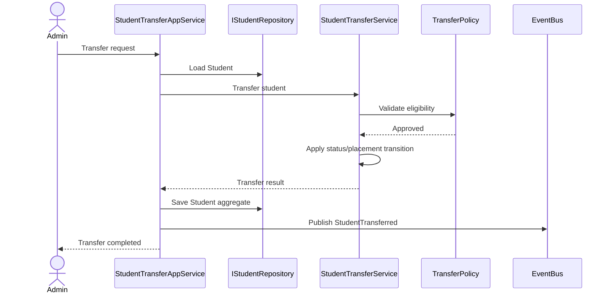
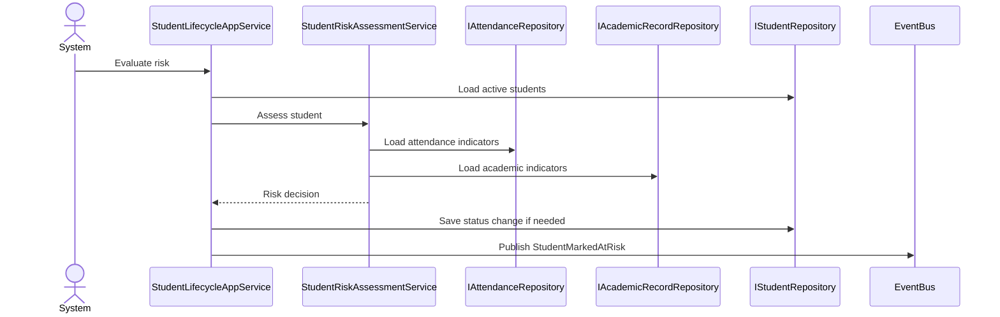
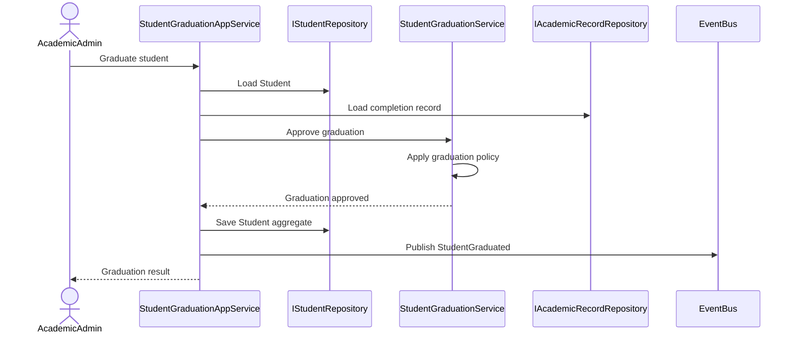
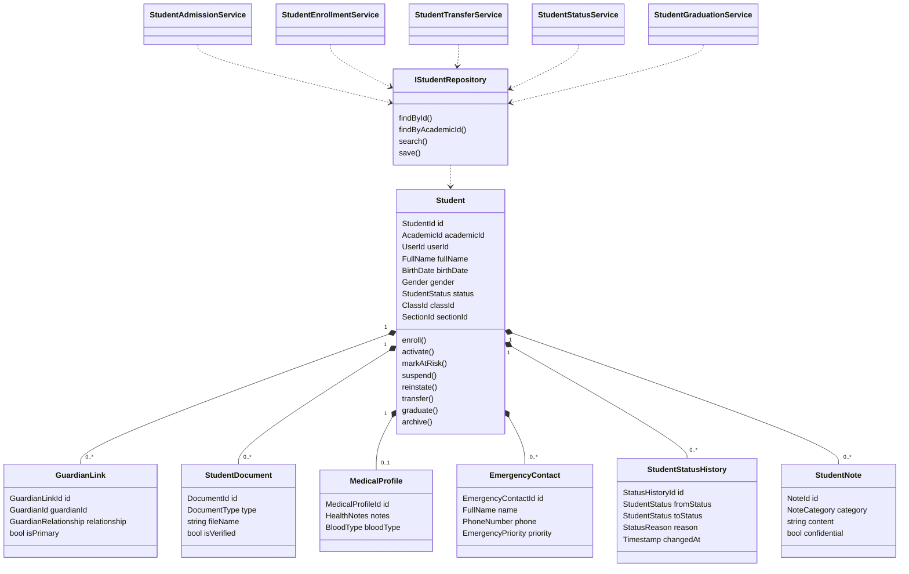

# Student Domain Architecture

**Phase:** 2 - Student Domain Analysis  
**Status:** Official architecture document, implementation-neutral  
**Scope:** Student bounded context for Al-Salam School Management System  
**Rule:** This document defines architecture only. It does not prescribe implementation code.

## 1. Student Aggregate

### Aggregate Boundary

The `Student` aggregate owns the lifecycle and identity of a student. It protects invariants for student identity, academic placement, guardianship, status changes, health notes, documents, and profile data.

The aggregate root is `Student`.

### Aggregate Root: Student

The `Student` aggregate root represents one learner known to the school. It is identified by an internal `StudentId` and a school-facing `AcademicId`.

Core responsibilities:

- Maintain immutable identity: `StudentId`, `AcademicId`, linked `UserId`.
- Maintain official personal profile: name, gender, birth date, national ID, photo.
- Maintain current placement: class, section, academic year, enrollment date.
- Enforce lifecycle transitions.
- Own primary guardian linkage from the student perspective.
- Record medical notes and emergency contact summary.
- Publish domain events for meaningful state changes.

### Aggregate-Owned Members

The Student aggregate may contain these owned entities when their lifecycle depends on the student:

- `GuardianLink`: relationship between student and guardian, including primary guardian flag.
- `StudentDocument`: official documents uploaded against the student file.
- `MedicalProfile`: health notes, allergies, chronic conditions, emergency instructions.
- `StudentPhoto`: current and historical student photos.
- `EmergencyContact`: ordered emergency contacts.
- `StudentStatusHistory`: audit-friendly status transition history.
- `StudentNote`: academic, behavioral, medical, or general notes.

### External References

The aggregate references, but does not own:

- `Class`
- `Section`
- `AcademicYear`
- `Term`
- `Parent` or `Guardian` master identity
- `User`
- `FinancialAccount`
- `AttendanceRecord`
- `GradeRecord`
- `Certificate`

### Core Invariants

- A student must have exactly one `StudentId`.
- A student must have exactly one unique `AcademicId`.
- A student must have a valid name, gender, and birth date.
- A student cannot be active without a valid class and section.
- A student cannot have more than one primary guardian link at the same time.
- A student cannot transition directly from `Applicant` to `Active`; admission and enrollment must occur first.
- Terminal states such as `Archived` cannot transition back to operational states without an explicit reactivation policy.
- Status history must be appended whenever the student lifecycle state changes.
- National ID, academic ID, RFID card ID, and linked user ID must remain unique where present.

## 2. Student Lifecycle

### Lifecycle Stages

1. `Applicant`: prospective student record created.
2. `Accepted`: application accepted by school administration.
3. `Enrolled`: student assigned to academic year, class, and section.
4. `Active`: student is currently attending and available to school operations.
5. `AtRisk`: student requires intervention due to academic, attendance, behavioral, or financial signals.
6. `Suspended`: student is temporarily restricted from normal participation.
7. `Transferred`: student has moved internally or externally.
8. `Graduated`: student completed the required academic stage.
9. `Archived`: student record is closed for normal operations.

### Lifecycle Rules

- Admission creates or advances an applicant to `Accepted`.
- Enrollment assigns the student to a class and section.
- Activation confirms the student is currently participating in school life.
- At-risk status is reversible when intervention criteria are satisfied.
- Suspension is temporary and must include a reason, issuer, and duration or review date.
- Transfer must preserve source and destination placement.
- Graduation requires academic completion approval.
- Archive is the final operational state for inactive historical records.

### Current-System Alignment Note

The current TypeScript student type and SQLite schema disagree on status values:

- TypeScript currently includes `inactive` and `suspended`.
- SQLite currently includes `graduated` and excludes `inactive` and `suspended`.

The official domain vocabulary should be:

`Applicant`, `Accepted`, `Enrolled`, `Active`, `AtRisk`, `Suspended`, `Transferred`, `Graduated`, `Archived`.

Persistence adapters may map this vocabulary to storage values, but the domain model should remain authoritative.

## 3. Student State Machine

### States

| State | Meaning | Terminal |
|---|---|---|
| `Applicant` | Application exists but is not accepted | No |
| `Accepted` | Application approved, not yet enrolled | No |
| `Enrolled` | Academic placement created | No |
| `Active` | Student is participating normally | No |
| `AtRisk` | Student requires intervention | No |
| `Suspended` | Student temporarily restricted | No |
| `Transferred` | Student moved out or to another placement | No |
| `Graduated` | Student completed academic requirements | No |
| `Archived` | Student record closed | Yes |

### Valid Transitions

| From | To | Trigger | Guard |
|---|---|---|---|
| None | `Applicant` | Application submitted | Required identity data present |
| `Applicant` | `Accepted` | Application approved | Admission policy passes |
| `Applicant` | `Archived` | Application rejected or withdrawn | Rejection reason recorded |
| `Accepted` | `Enrolled` | Enrollment completed | Class, section, and academic year valid |
| `Enrolled` | `Active` | School participation begins | Enrollment is current |
| `Active` | `AtRisk` | Risk detected | At-risk policy threshold met |
| `AtRisk` | `Active` | Intervention resolved | Risk policy cleared |
| `Active` | `Suspended` | Disciplinary action issued | Suspension policy passes |
| `Suspended` | `Active` | Suspension resolved | Resolution approved |
| `Active` | `Transferred` | Transfer completed | Transfer policy passes |
| `AtRisk` | `Transferred` | Transfer completed | Transfer policy passes |
| `Active` | `Graduated` | Graduation approved | Graduation policy passes |
| `Graduated` | `Archived` | Record archived | Archive policy passes |
| `Transferred` | `Archived` | Record archived | Archive policy passes |
| `Suspended` | `Archived` | Administrative closure | Closure reason recorded |

### State Diagram

## 4. Value Objects

| Value Object | Purpose | Main Rules |
|---|---|---|
| `StudentId` | Internal identity | Globally unique, immutable |
| `AcademicId` | School-facing student number | Unique, stable, formatted by school policy |
| `UserId` | Linked auth identity | Must reference an existing user when linked |
| `FullName` | Official student name | Required, normalized, max length enforced |
| `NationalId` | Government identity | Optional by policy, unique where present |
| `BirthDate` | Date of birth | Cannot be future; must satisfy age policy |
| `Gender` | Student gender | Domain-approved values only |
| `PhoneNumber` | Contact number | Normalized, country-aware format |
| `Address` | Student residence | Required fields depend on school policy |
| `ClassId` | Current class reference | Must reference active class |
| `SectionId` | Current section reference | Must belong to selected class |
| `AcademicYearId` | Academic year reference | Must be current or valid historical year |
| `TermId` | Term reference | Must belong to academic year |
| `EnrollmentDate` | Date enrolled | Cannot violate enrollment calendar |
| `StudentStatus` | Lifecycle status | Must follow state machine |
| `HealthNotes` | Medical notes summary | Confidentiality rules apply |
| `RfidCardId` | RFID card identity | Unique while active |
| `GuardianRelationship` | Guardian relation | Domain-approved relationship vocabulary |
| `DocumentType` | Student document category | Must be allowed by document policy |
| `BloodType` | Medical blood type | Valid blood type values only |
| `EmergencyPriority` | Emergency contact order | Positive integer, unique per student |
| `Percentage` | Academic or attendance percentage | 0 to 100 |
| `Gpa` | Grade point average | Scale defined by grading policy |
| `Rank` | Class ranking | Positive integer |
| `StatusReason` | Reason for lifecycle transition | Required for administrative transitions |
| `Timestamp` | Auditable point in time | Immutable once recorded |

## 5. Entities

### Aggregate Entities

| Entity | Identity | Ownership | Notes |
|---|---|---|---|
| `Student` | `StudentId` | Aggregate root | Owns lifecycle and invariants |
| `GuardianLink` | `GuardianLinkId` | Student aggregate | Links existing guardian/parent to student |
| `StudentDocument` | `DocumentId` | Student aggregate | Documents in student file |
| `MedicalProfile` | `MedicalProfileId` | Student aggregate | Health data and emergency notes |
| `StudentPhoto` | `PhotoId` | Student aggregate | Current and previous photos |
| `EmergencyContact` | `EmergencyContactId` | Student aggregate | Ordered emergency contact list |
| `StudentStatusHistory` | `StatusHistoryId` | Student aggregate | Append-only lifecycle history |
| `StudentNote` | `NoteId` | Student aggregate | Staff notes with category and confidentiality |

### Related Independent Entities

| Entity | Owning Context | Relationship |
|---|---|---|
| `Enrollment` | Enrollment/Academic context | Created from student enrollment workflow |
| `AcademicRecord` | Grading context | References student |
| `AttendanceRecord` | Attendance context | References student |
| `FinancialAccount` | Financial context | References student |
| `Certificate` | Certificates context | References graduated student |
| `TransferRecord` | Student or Transfer context | Records transfer transaction |
| `PromotionRecord` | Academic context | Records grade progression |
| `DisciplineIncident` | Discipline context | May drive student suspension |

## 6. Domain Events

| Event | Published When | Key Payload |
|---|---|---|
| `StudentApplicationSubmitted` | Applicant record is created | studentId, applicant data, submittedAt |
| `StudentAccepted` | Applicant is accepted | studentId, acceptedBy, acceptedAt |
| `StudentEnrollmentCompleted` | Class/section enrollment is completed | studentId, classId, sectionId, academicYearId |
| `StudentActivated` | Student becomes active | studentId, activatedAt |
| `StudentMarkedAtRisk` | Risk threshold is met | studentId, reason, indicators |
| `StudentRiskResolved` | Student returns from at-risk to active | studentId, resolution |
| `StudentSuspended` | Suspension is issued | studentId, reason, duration, issuedBy |
| `StudentReinstated` | Suspension is resolved | studentId, reinstatedBy, reinstatedAt |
| `StudentTransferred` | Transfer completes | studentId, fromPlacement, toPlacement, transferType |
| `StudentGraduated` | Graduation approved | studentId, academicYearId, certificateId |
| `StudentArchived` | Record is archived | studentId, reason, archivedBy |
| `StudentStatusChanged` | Any lifecycle status changes | studentId, fromStatus, toStatus, reason |
| `GuardianAssignedToStudent` | Guardian link is added | studentId, guardianId, relationship, isPrimary |
| `PrimaryGuardianChanged` | Primary guardian changes | studentId, previousGuardianId, newGuardianId |
| `StudentDocumentUploaded` | Document added | studentId, documentId, documentType |
| `StudentDocumentVerified` | Document verified | studentId, documentId, verifiedBy |
| `StudentMedicalProfileUpdated` | Medical data changes | studentId, updatedBy |
| `StudentPhotoUpdated` | Current photo changes | studentId, photoId |
| `StudentPersonalInfoUpdated` | Official profile changes | studentId, changedFields, updatedBy |

### Event Rules

- Events are facts; they must be named in past tense.
- Events must not contain UI state.
- Events should include IDs and essential facts, not full mutable objects.
- Cross-context integrations must consume events instead of directly modifying Student internals.

## 7. Domain Policies

| Policy | Responsibility |
|---|---|
| `AdmissionPolicy` | Determines whether an applicant may be accepted |
| `AgeEligibilityPolicy` | Validates age for admission and grade level |
| `EnrollmentPolicy` | Validates class, section, capacity, academic year, and enrollment calendar |
| `GuardianPolicy` | Requires valid primary guardian and relationship rules |
| `DocumentRequirementPolicy` | Defines required documents per enrollment type |
| `TransferPolicy` | Validates internal/external transfer eligibility |
| `PromotionPolicy` | Determines grade advancement eligibility |
| `GraduationPolicy` | Determines graduation eligibility |
| `SuspensionPolicy` | Validates disciplinary suspension and reinstatement |
| `AtRiskPolicy` | Determines whether a student should be flagged or cleared |
| `ArchivePolicy` | Determines whether a record may be closed |
| `RfidAssignmentPolicy` | Ensures RFID card uniqueness and assignment validity |

## 8. Domain Services

Domain services contain business operations that do not naturally belong to one entity or require collaboration between aggregates/repositories/policies.

| Domain Service | Responsibility |
|---|---|
| `StudentAdmissionService` | Accepts applicants according to admission and age policies |
| `StudentEnrollmentService` | Enrolls accepted students into academic placement |
| `StudentTransferService` | Coordinates transfer decisions and transition events |
| `StudentPromotionService` | Determines and records promotion eligibility |
| `StudentGraduationService` | Approves graduation and publishes graduation event |
| `StudentStatusService` | Applies guarded lifecycle transitions |
| `GuardianAssignmentService` | Assigns, removes, and changes primary guardian |
| `StudentDocumentService` | Applies document requirement and verification rules |
| `StudentMedicalService` | Updates health profile with confidentiality checks |
| `StudentRiskAssessmentService` | Evaluates at-risk criteria from academic, attendance, and behavior signals |
| `StudentIdentityService` | Ensures academic ID, national ID, and RFID uniqueness |

## 9. Application Services

Application services orchestrate use cases. They do not own domain rules.

| Application Service | Responsibility |
|---|---|
| `StudentApplicationAppService` | Handles applicant intake and acceptance orchestration |
| `StudentRegistrationAppService` | Coordinates admission plus enrollment |
| `StudentProfileAppService` | Updates personal, guardian, medical, photo, and document data |
| `StudentLifecycleAppService` | Executes status transitions through domain services |
| `StudentTransferAppService` | Orchestrates transfer request, approval, and completion |
| `StudentPromotionAppService` | Runs individual or batch promotion workflows |
| `StudentGraduationAppService` | Runs graduation workflow and certificate handoff |
| `StudentSearchAppService` | Provides read/search use cases for UI screens |
| `StudentReportAppService` | Builds printable/exportable student reports |
| `StudentImportExportAppService` | Coordinates bulk import/export validation and result reporting |

Application service duties:

- Authorize the caller.
- Validate input DTO shape.
- Open and commit/rollback unit of work.
- Load aggregates and related references.
- Invoke domain services.
- Persist aggregate changes.
- Publish or dispatch collected domain events.
- Map domain results to response DTOs.

## 10. Repository Interfaces

### Student Repository

The Student repository persists and retrieves the Student aggregate.

Required capabilities:

- Find by `StudentId`.
- Find by `AcademicId`.
- Find by linked `UserId`.
- Find by national ID where present.
- Find by RFID card ID where present.
- Search by name, guardian phone, class, section, and status.
- Save the full Student aggregate.
- Append status history.
- Check uniqueness for academic ID, national ID, and RFID card ID.

### Supporting Repository Interfaces

| Repository | Purpose |
|---|---|
| `IStudentRepository` | Student aggregate persistence |
| `IGuardianRepository` | Guardian identity lookup and validation |
| `IEnrollmentRepository` | Enrollment records by year/term |
| `IAcademicRecordRepository` | Academic performance and promotion inputs |
| `IAttendanceRepository` | Attendance metrics for at-risk policy |
| `IDisciplineRepository` | Suspension and behavior inputs |
| `IDocumentRepository` | Student document metadata |
| `IClassRepository` | Class validation and capacity |
| `ISectionRepository` | Section validation and capacity |
| `IStudentReadRepository` | Optimized search/report projections |

### Repository Rules

- Repositories expose domain concepts, not SQL tables.
- Repositories do not enforce lifecycle policies; they support them.
- Query/read repositories may return projections.
- Command repositories return aggregates or persistence results.
- Infrastructure mappings must not leak into the domain model.

## 11. Use Cases

| Use Case | Actor | Primary Result |
|---|---|---|
| Submit student application | Registrar | Applicant created |
| Accept student application | Registrar/Admin | Student accepted |
| Register new student | Registrar | Student admitted and enrolled |
| Activate enrolled student | Registrar/Admin | Student active |
| Update student profile | Registrar/Admin | Personal profile updated |
| Assign primary guardian | Registrar/Admin | Guardian link established |
| Upload student document | Registrar/Admin | Document added to file |
| Verify student document | Admin | Document verified |
| Update medical profile | Nurse/Admin | Medical profile updated |
| Assign RFID card | Admin | RFID linked to student |
| Mark student at risk | Counselor/Admin/System | Student flagged for intervention |
| Resolve at-risk status | Counselor/Admin | Student returned to active |
| Suspend student | Admin/Discipline officer | Student suspended |
| Reinstate suspended student | Admin | Student active again |
| Transfer student | Registrar/Admin | Student transferred |
| Promote student | Academic admin | Student promoted to next level |
| Graduate student | Academic admin | Student graduated |
| Archive student record | Admin | Record closed |
| Search students | Staff | Student list projection returned |
| Generate student report | Staff/Admin | Report projection produced |
| Import students in bulk | Admin | Valid records imported and failures reported |

## 12. Sequence Diagrams

### Register New Student

### Transfer Student

### Mark Student At Risk

### Graduate Student

## 13. Class Diagram

## 14. Database Mapping

Database tables are persistence details. The domain model remains authoritative.

### Current Table Mapping

| Domain Concept | Current Storage | Notes |
|---|---|---|
| `Student` | `students` | Main aggregate root persistence |
| `StudentId` | `students.id` | Primary key |
| `UserId` | `students.user_id` | Unique linked auth identity |
| `AcademicId` | `students.academic_id` | Unique school-facing ID |
| `FullName` | `students.name` | Current flat storage |
| `ClassId` | `students.class_id` | Foreign key to class |
| `SectionId` | `students.section_id` | Foreign key to section |
| `GuardianLink` | `parent_students` | Existing relationship table |
| `Primary guardian summary` | `students.parent_id`, `parent_name`, `parent_phone` | Denormalized current storage |
| `BirthDate` | `students.birth_date` | ISO date recommended |
| `Gender` | `students.gender` | Current check: `male`, `female` |
| `StudentStatus` | `students.status` | Must be aligned with official lifecycle |
| `HealthNotes` | `students.health_notes` | Summary only |
| `StudentPhoto` | `students.photo` | Current single-photo field |
| `EnrollmentDate` | `students.enrollment_date` | Initial enrollment date |

### Recommended Future Tables

| Table | Purpose |
|---|---|
| `students` | Student aggregate root snapshot |
| `student_guardians` | Guardian links, relationship, primary flag |
| `student_documents` | Document metadata and verification status |
| `student_medical_profiles` | Medical profile and emergency instructions |
| `student_photos` | Photo history and current photo marker |
| `student_emergency_contacts` | Ordered emergency contacts |
| `student_status_history` | Append-only lifecycle transitions |
| `student_notes` | Staff notes and confidentiality metadata |
| `student_transfers` | Transfer transaction records |
| `student_promotions` | Promotion transaction records |
| `student_graduations` | Graduation transaction records |

### Mapping Rules

- Store value objects as scalar columns or structured owned rows.
- Reconstruct aggregates through repositories.
- Keep read models separate from write models when search/report needs grow.
- Do not let database status constraints define domain vocabulary.
- Preserve historical facts in append-only event/history tables.

## 15. Future Extensions

### Near Term

- Align TypeScript and SQL status values with the official lifecycle vocabulary.
- Introduce domain-level status transition validation.
- Add status history persistence.
- Add document requirement modeling.
- Add primary guardian consistency rules.
- Add academic ID generation policy.

### Medium Term

- Batch admission and enrollment.
- CSV/Excel student import with validation report.
- Student timeline view driven by domain events.
- Document verification workflow.
- Student photo history and thumbnail handling.
- At-risk dashboard using attendance, grades, and discipline signals.
- Promotion and graduation batch workflows.

### Long Term

- Alumni bounded context after graduation.
- Parent portal access to student profile, attendance, grades, and fees.
- Multi-branch school transfer support.
- Configurable student custom fields by grade level.
- National ID verification integration.
- Medical visit and vaccination tracking.
- Sibling detection through shared guardians.
- Event-sourced student lifecycle history if audit requirements increase.

