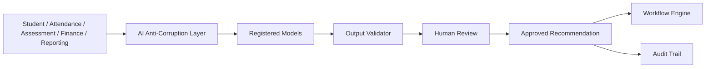

# AI Governance

**Phase:** 4.0 — Enterprise Platform Governance
**Status:** Official governance — architecture only
**Scope:** Education ERP Platform — AI usage policy, human-in-the-loop, model registry, input/output validation, AI integration through ACLs, audit of AI decisions
**Canonical source:** `docs/governance/Architecture-Governance.md`
**Reference standards:**
- `docs/architecture/bounded-context-map.md` (AI context, ACL requirements)
- `docs/architecture/enterprise-business-interaction-architecture.md` (AI workflows, event consumption)
- `docs/governance/Security-Governance.md`, `docs/governance/Data-Governance.md`
- `src/lib/ai-client.ts` (existing AI client infrastructure)

**Rule:** Architecture only. No implementation introduced by this document.

---

## 1. Purpose

This document governs the use of artificial intelligence and machine learning capabilities in the Education ERP Platform: which AI use cases are allowed, how AI integrates with bounded contexts, how AI outputs are validated and reviewed by humans, how models are registered and tracked, and how AI decisions are audited.

---

## 2. AI Use Case Policy

The AI context owns AI insight requests, recommendations, predictions, assistant interactions, model runs, and human review of AI-generated suggestions. It integrates only with the contexts identified in the Bounded Context Map (Student, Attendance, Assessment, Finance, Reporting via ACL; Workflow via events).

### 2.1 Allowed Use Cases

| Area | Example | Integration |
|---|---|---|
| Student risk insight | Predict at-risk students from attendance/assessment signals | ACL over Attendance/Assessment events |
| Academic insight | Trends and performance summaries for staff review | ACL over Reporting snapshots |
| Financial insight | Overdue/invoice patterns for finance review | ACL over Finance projections |
| Assistant interactions | Administrative Q&A over permitted data | ACL + human review |
| Report assistance | Drafting report summaries for human approval | ACL over Reporting outputs |

### 2.2 Forbidden Use Cases

- AI directly mutating operational aggregates (Student, Academic, Attendance, Assessment, Certificate, Finance).
- AI making irreversible decisions (graduation, certificate issuance, refunds, suspensions) without human approval.
- AI accessing Restricted/PII data without an approved ACL and consent basis.
- AI outputs used as the sole basis for high-stakes decisions.
- Unregistered models or prompts in production.

---

## 3. Human-in-the-Loop

- Every AI recommendation that affects an operational decision requires human review and explicit approval (`ApproveAIRecommendationCommand`, `AIRecommendationApproved`/`Rejected`).
- Human review is recorded in the audit trail with actor, decision, and correlation ID.
- AI cannot complete a workflow without a human decision for irreversible steps.
- Confidence below a defined threshold routes to manual handling rather than recommendation.

---

## 4. Model Registry

Every model in production is registered:

| Field | Purpose |
|---|---|
| Model ID | Unique identifier |
| Model type | Risk, insight, assistant, prediction |
| Provider | LLM/ML provider |
| Version | Model version |
| Purpose | Approved use case |
| Data inputs | Approved data scope |
| Review status | Approved / pending / rejected |
| Owner | Responsible role |
| Effective date | When active |

Rules:

- Only registered models may run in production.
- Model changes require re-review.
- Deprecated models follow the Deprecation Rules (DPR).

---

## 5. Input and Output Validation

- AI inputs pass through an ACL: normalized, validated, PII-minimized, and scoped to the approved use case.
- AI outputs are validated by an output validator before any human review: schema, allowed values, language, and safety filters.
- Prompts are templated and versioned; free-form prompt injection is not accepted in production paths.
- Outputs that fail validation are rejected and logged; never forwarded to operational contexts.

---

## 6. AI Integration Boundaries

Rules:

- AI consumes events and projections only through the ACL.
- AI never writes to operational tables.
- Approved recommendations reach operational contexts through published commands/events and the Workflow Engine.
- Every AI decision chain is traceable via correlation ID.

---

## 7. Data Privacy and Fairness

- AI data inputs are minimized to what is necessary for the approved purpose.
- Restricted/PII data requires explicit consent basis and an approved ACL.
- Model outputs are reviewed for bias and fairness, especially for student-facing decisions.
- No student or family data leaves the platform without an approved contract and safeguards.

---

## 8. Audit of AI Decisions

- `AIInsightRequested`, `AIInsightGenerated`, `AIRecommendationCreated`, `AIRecommendationApproved`, `AIRecommendationRejected`, and `RiskPredictionUpdated` are recorded events.
- Audit entries include: model version, inputs scope, output, human reviewer, decision, correlation ID, trace ID.
- AI audit records are append-only and tamper-evident.
- Misuse or unexpected outputs trigger the incident response process (`Security-Governance` §9).

---

## 9. Certification Checklist

- [ ] AI use cases are approved and bounded.
- [ ] Forbidden use cases are explicit.
- [ ] Human-in-the-loop is required.
- [ ] Model registry is defined.
- [ ] Input/output validation is defined.
- [ ] AI integration boundaries are defined (ACL only).
- [ ] Data privacy and fairness are defined.
- [ ] AI decisions are auditable.
- [ ] Consistent with Bounded Context Map and Interaction Architecture.
- [ ] No code, SQL, UI, or implementation introduced.

---

*End of AI Governance*

**Next:** Release governance.

