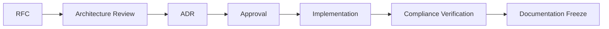

# Architecture Governance

**Phase:** 4.0 — Enterprise Platform Governance
**Status:** Official governance — architecture only
**Scope:** Education ERP Platform
**Reference standards:**
- `docs/00-constitution.md`
- `docs/standards/student-domain-standard.md`
- `docs/architecture/bounded-context-map.md` (Phase 3.1)
- `docs/architecture/enterprise-business-interaction-architecture.md` (Phase 3.2)
- `docs/governance/Decision-Matrix.md`
- `docs/rfc/Architecture-Change-Process.md`

**Rule:** Architecture only. No code, no SQL, no UI, no implementation.

---

## 1. Purpose

This document is the canonical governance source for the Education ERP Platform architecture. It defines the architecture principles, dependency rules, naming rules, versioning rules, deprecation rules, backward compatibility rules, extension governance, and the architecture change process that every future phase and contributor must follow.

It is the top-level governance document. Other governance documents (`Engineering-Governance`, `Data-Governance`, `Integration-Governance`, `Security-Governance`, `AI-Governance`, `Release-Governance`) elaborate specific areas and are subordinate to this document. Where a conflict exists, this document wins.

---

## 2. Architecture Principles

These principles are binding and non-negotiable. They are derived from the decisions recorded in `docs/adr/` and from Phases 3.0–3.2.

| # | Principle | Statement |
|---|---|---|
| AP-01 | Single Source of Truth | Every concept is owned by exactly one bounded context. Ownership is defined in the Bounded Context Map and must never be ambiguous. |
| AP-02 | Local Transaction, Global Consistency | Each aggregate changes atomically inside its own context. Cross-context consistency is achieved by events, projections, and sagas — never by distributed locks or cross-context repositories. |
| AP-03 | Published Contracts Only | Everything crosses a context boundary through a published contract: commands, queries, DTOs, events, read models, and error codes. No direct repository access. |
| AP-04 | Events Are Facts | Domain events are past-tense, immutable, versioned, and idempotent. Events never expose internal persistence records. |
| AP-05 | Reliable Delivery | Every write uses an Outbox; every consumer uses an Inbox. At-least-once delivery with exactly-once effect. |
| AP-06 | Trace Everything | Every business operation carries correlation ID, causation ID, and distributed trace ID, propagated to audit, logs, events, and projections. |
| AP-07 | Compensate, Don't Roll Back | Multi-context workflows use saga-style compensation. Cross-context rollback is forbidden. |
| AP-08 | Offline-First | School-level operations work offline; authoritative operations require synchronization. |
| AP-09 | Human-in-the-Loop | Irreversible decisions (graduation, certificate issuance, refunds, administrative transitions) require approvals and audit. |
| AP-10 | Small Shared Kernel | The Shared Kernel is limited to stable primitives and never contains aggregates, repositories, policies, or workflow state. |
| AP-11 | ACL for Foreign Models | External, legacy, ministry, and AI-generated models must pass through an Anti-Corruption Layer. AI can never directly mutate operational aggregates. |
| AP-12 | Architecture Before Implementation | Every material architecture decision is documented (RFC → ADR) before implementation. Documentation Freeze protects approved contracts. |

---

## 3. Dependency Rules

Dependency rules are enforced by architecture reviews and compliance checks. They are canonical here and referenced by every other governance document.

| # | Rule |
|---|---|
| DR-01 | Layer dependency direction is `presentation -> application -> domain` and `infrastructure -> domain`. |
| DR-02 | No context may call another context's repository directly. |
| DR-03 | No context may write to another context's tables or persistence records. |
| DR-04 | Aggregate instances are never shared across contexts. |
| DR-05 | Cross-context writes go through application services or commands exposed as published contracts. |
| DR-06 | Cross-context reads use published query contracts, read models, or projections. |
| DR-07 | Cross-context notifications use domain events or integration events. |
| DR-08 | Synchronous integration is allowed only for decisions that need an immediate answer: authorization, authentication, placement validation, eligibility checks, payment gateway confirmation, workflow task approval. All other integration is asynchronous. |
| DR-09 | UI DTOs are never used as integration contracts. |
| DR-10 | AI-generated output never mutates operational aggregates directly; it always passes through an ACL and human review. |
| DR-11 | Every new dependency between contexts must be declared in the Bounded Context Map before implementation, with a relationship type and owning public contract. |
| DR-12 | The domain layer must not depend on React, SQL, storage engines, HTTP, UI, or infrastructure adapters. |

### 3.1 Forbidden Dependencies

- Direct imports from another context's infrastructure layer.
- Direct calls to another context's repository.
- Sharing aggregate instances across contexts.
- Updating another context's tables.
- Using UI DTOs as integration contracts.
- AI output directly mutating operational aggregates.
- Reverse dependencies from domain to presentation or infrastructure.

### 3.2 Allowed Dependencies

- Calling another context's application service when a synchronous decision is required.
- Consuming another context's published read contract.
- Reacting to another context's published domain or integration event.
- Maintaining a local projection of another context's public event stream.
- Sharing stable IDs and primitive value objects from the Shared Kernel.
- Using ACL translators for external or legacy models.

---

## 4. Naming Rules

Naming rules are canonical and apply across modules, files, code, contracts, events, migrations, and governance artifacts. The full matrix is maintained in `docs/governance/Decision-Matrix.md`.

| Artifact | Rule | Example |
|---|---|---|
| Module folder | lowercase domain name | `student`, `teacher`, `financial`, `master-data` |
| File name | `kebab-case` | `student-service.ts` |
| Function / variable | `camelCase` | `getStudentById` |
| Class / aggregate / model | `PascalCase` singular noun | `Student`, `AcademicYear` |
| Value object | `PascalCase` noun | `StudentNumber`, `DateRange` |
| Domain entity | `PascalCase` noun | `Enrollment`, `StatusHistory` |
| Domain event | past-tense `PascalCase` | `StudentRegistered`, `GradebookPublished` |
| Repository interface | `I<Name>Repository` | `IStudentRepository` |
| Read repository | `I<Name>ReadRepository` | `IStudentReadRepository` |
| Command | verb-object ending `Command` | `RegisterStudentCommand` |
| Query | verb-object ending `Query` | `GetStudentByIdQuery` |
| DTO | object name ending `Dto` | `StudentDto`, `EnrollmentDto` |
| Policy | business concept ending `Policy` | `AdmissionPolicy` |
| Specification | business rule ending `Specification` | `StudentAgeSpecification` |
| Hook | `use<Name>` | `useStudent`, `useAcademicYear` |
| Table name | lowercase `snake_case`, plural where entity collection | `academic_years`, `grade_levels` |
| Migration file | zero-padded sequence + snake name | `001_master_data.sql` |
| ADR | `ADR-NNNN` | `ADR-0001` |
| RFC | `RFC-YYYY-NNN` | `RFC-2026-001` |
| Schema record ID | stable lowercase `snake_case` text key | `grade_1`, `ay_2025_2026` |
| Schema code | uppercase prefix groups | `STG-PRI`, `GRD-01`, `ATT-ABS` |

All user-facing text follows the Constitution language rule: Arabic UI with `dir="rtl"`, technical comments in English.

---

## 5. Versioning Rules

| # | Rule |
|---|---|
| VR-01 | Platform releases use Semantic Versioning `MAJOR.MINOR.PATCH` (`docs/governance/Release-Governance.md`). |
| VR-02 | Published contracts are versioned independently. A breaking change requires a new contract version and a major platform version alignment. |
| VR-03 | Events are versioned and immutable. Published event schemas are never modified; new fields are additive with safe defaults. |
| VR-04 | Database migrations are sequentially numbered and never reordered or rewritten after application (`docs/governance/Data-Governance.md`). |
| VR-05 | ADRs are sequentially numbered and immutable once accepted. Corrections are recorded as new ADRs. |
| VR-06 | RFCs carry a year-sequential identifier and move through the lifecycle defined in `docs/rfc/Architecture-Change-Process.md`. |
| VR-07 | A contract's version is carried in its published metadata; event envelopes carry `eventType` and `eventVersion`. |
| VR-08 | The Bounded Context Map itself is versioned through the review process; material changes require an ADR. |

---

## 6. Deprecation Rules

| # | Rule |
|---|---|
| DPR-01 | A contract or capability may be deprecated only when a replacement is available and published. |
| DPR-02 | The deprecation notice window is at least one full minor release before removal. |
| DPR-03 | Deprecation must be announced via RFC/ADR, the change log, and the contract registry. |
| DPR-04 | Deprecated contracts must continue to function and log deprecation warnings. |
| DPR-05 | Removal is permitted only in the next major version. |
| DPR-06 | Events are never silently removed; at minimum a tombstone and deprecation window are required. |
| DPR-07 | Deprecated entities/fields are flagged in the data dictionary and migration governance before removal. |

---

## 7. Backward Compatibility Rules

| # | Rule |
|---|---|
| BC-01 | Additive changes are always backward compatible. |
| BC-02 | Fields may be added; they are never removed or renamed without a new contract version. |
| BC-03 | Event schemas are additive only; consumers tolerate unknown fields. |
| BC-04 | Read models may change shape; consumers must tolerate missing or partial data. |
| BC-05 | Event consumers must tolerate missing, duplicate, and out-of-order events (idempotent processing). |
| BC-06 | Cross-version compatibility is verified with contract tests before release. |
| BC-07 | A breaking change to any published contract triggers the versioning and deprecation rules above. |

---

## 8. Extension Governance

### 8.1 New Bounded Context

A new bounded context may only be added through the Architecture Change Process:

1. Raise an RFC (`docs/rfc/Architecture-Change-Process.md`).
2. Add the context to the Bounded Context Map with purpose, owner, aggregate roots, public contracts, events, Shared Kernel usage, ACL requirements, and relationship types.
3. Record an ADR for the boundary decision.
4. Pass the context certification checklist before implementation.

A context is integration-certified when: purpose and owner are documented; aggregate roots are listed; public contracts are listed; published and consumed events are listed; Shared Kernel usage is explicit; ACL requirements are explicit; relationship types are defined; no direct repository access crosses boundaries; contract tests are planned.

### 8.2 New Domain Module

Every new domain module must follow the Student Domain Standard:

```text
src/modules/<domain>/
├── application/
├── domain/
├── infrastructure/
├── presentation/
└── tests/
```

A module is not certified until its domain layer has no UI, SQL, HTTP, or framework dependencies; aggregates protect invariants; value objects validate and normalize; events are past-tense facts; repository contracts are persistence-agnostic; application services contain orchestration only; tests are focused and runnable independently.

### 8.3 Extension Points

- Extensions may integrate only through published contracts, events, and read models.
- Third-party or external extensions require an ACL, a security review, and an ADR.
- AI-based extensions follow `docs/governance/AI-Governance.md`.
- No extension may bypass the Shared Kernel limits or the dependency rules.

---

## 9. Architecture Change Process

The full process is defined in `docs/rfc/Architecture-Change-Process.md`. The lifecycle is:



- Minor, additive, or clarifying changes follow the lightweight path (documentation update + review).
- Material changes (new context, breaking contract change, persistence change, new external integration, deprecation) follow the full RFC → ADR path.

---

## 10. Exception Process

- Any deviation from these rules requires a documented exception.
- Exceptions are recorded as RFCs with rationale, impact, owner, and expiry.
- Approved exceptions are tracked in `docs/governance/Decision-Matrix.md` and reviewed at the next architecture review.
- Exceptions do not override the Constitution's non-negotiable rules.

---

## 11. Compliance and Enforcement

- Architecture compliance is verified by automated checks and architecture reviews.
- Fitness functions (dependency direction, forbidden imports, naming, contract versioning) are enforced in CI where possible.
- Violations are recorded in the compliance report and must be resolved before the phase is considered complete.
- The reference baseline is `docs/architecture-compliance-report.md` (Phases 1.1 + 1.2) and every subsequent phase report.

---

## 12. Documentation Lifecycle and Freeze

- Architecture documents are living artifacts while a phase is in progress and are frozen when the phase is approved.
- **Documentation Freeze:** Phase 4.0 is the final strategic documentation phase. After approval, no new strategic architecture documentation is added without an RFC. The next phase is implementation, beginning with the Academic Domain.

---

## 13. Certification Checklist

- [ ] Architecture principles are defined and canonical.
- [ ] Dependency rules are defined and enforceable.
- [ ] Naming rules are defined and canonical.
- [ ] Versioning rules are defined.
- [ ] Deprecation rules are defined.
- [ ] Backward compatibility rules are defined.
- [ ] Extension governance is defined.
- [ ] Architecture change process is defined (RFC → ADR).
- [ ] Decision matrix exists (`docs/governance/Decision-Matrix.md`).
- [ ] Consistent with Phases 3.0–3.2 documents and the Student Domain Standard.
- [ ] No code, SQL, UI, or implementation introduced.

---

*End of Architecture Governance*

**Next:** Elaborated by `Engineering-Governance`, `Data-Governance`, `Integration-Governance`, `Security-Governance`, `AI-Governance`, and `Release-Governance`.

