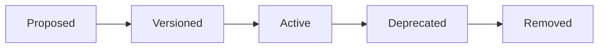

# Integration Governance

**Phase:** 4.0 — Enterprise Platform Governance
**Status:** Official governance — architecture only
**Scope:** Education ERP Platform — published contracts, APIs, events, error codes, anti-corruption layers, contract versioning and lifecycle
**Canonical source:** `docs/governance/Architecture-Governance.md`
**Reference standards:**
- `docs/architecture/bounded-context-map.md` (Published Language, ACL, integration rules)
- `docs/architecture/enterprise-business-interaction-architecture.md` (outbox, inbox, retry, DLQ, correlation)
- `docs/standards/student-domain-standard.md` (contract naming)

**Rule:** Architecture only. No implementation introduced by this document.

---

## 1. Purpose

This document governs how contexts and external systems integrate. It defines the Published Language, the contract lifecycle, API rules, event contracts, error-code standards, and anti-corruption layer requirements. It operationalizes the integration principles of the Bounded Context Map (Phase 3.1) and the cross-cutting contracts of the Enterprise Business Interaction Architecture (Phase 3.2).

---

## 2. Published Language

Each context must publish:

| Contract Category | Form | Naming |
|---|---|---|
| Commands | Write use cases | verb-object ending `Command` |
| Queries | Read use cases | verb-object ending `Query` |
| DTOs | Application-facing data | ending `Dto` |
| Domain events | Past-tense facts | `StudentRegistered`, `GradebookPublished` |
| Read models | Projection-oriented reads | `...ReadModel` / `...Projection` |
| Error codes | Contract-level failures | `DOMAIN.MODULE.CODE` pattern |

Rules:

- Every cross-context integration has an owning public contract.
- UI DTOs are never used as integration contracts.
- Contracts are versioned when breaking changes are introduced (Versioning Rules VR-02).

---

## 3. Contract Lifecycle

| State | Rules |
|---|---|
| Proposed | RFC under review; not consumable by other contexts |
| Versioned | Contract number assigned; schema frozen |
| Active | Available for consumption |
| Deprecated | Still functional; logs warnings; removal only in next major version (DPR) |
| Removed | Only after deprecation window; recorded in change log |

---

## 4. Event Contract Rules

- Events are immutable, past-tense facts carrying `eventId`, aggregate identifier, `occurredAt`, and optional `aggregateVersion`.
- Event schemas are additive only; consumers tolerate unknown fields.
- Events are published via the Outbox and consumed via the Inbox (exactly-once effect).
- Consumers tolerate missing, duplicate, and out-of-order events.
- Event types are fully qualified and versioned (`eventType`, `eventVersion`).
- Events never expose internal persistence records.

---

## 5. API and Application-Service Rules

### 5.1 General

- Synchronous application-service contracts are used only when the caller needs an immediate decision: authorization, authentication, academic placement validation, teacher eligibility, payment gateway confirmation, workflow task approval.
- All other integration is asynchronous via events.
- Commands carry an `idempotencyKey`; unique constraints prevent duplicate execution.
- Queries never mutate aggregates.

### 5.2 Authorization and Authentication

- Every command is authorized through the Security context (`AuthorizeActionCommand`, `PermissionDto`).
- Authorization is synchronous.
- Workflow task actions require re-authorization at task execution time.
- Sensitive operations require elevated permissions and audit.

### 5.3 Pagination and Read Contracts

- Read contracts return `Pagination` and `SortOrder` from the Shared Kernel.
- Read models are denormalized projections; their shape may change within version rules.
- Read queries must tolerate partial or eventually-consistent data.

---

## 6. Error Code Standard

Error codes follow `DOMAIN.MODULE.CODE`, for example `STUDENT.ENROLLMENT.DUPLICATE`.

Error classification:

| Class | Meaning | Example |
|---|---|---|
| `VALIDATION` | Input does not satisfy contract rules | `STUDENT.ENROLLMENT.INVALID_PLACEMENT` |
| `BUSINESS` | Domain rule prevents operation | `ACADEMIC.SCHEDULE.CONFLICT` |
| `PERMISSION` | Authorization denied | `SECURITY.AUTHZ.DENIED` |
| `NOT_FOUND` | Referenced aggregate missing | `STUDENT.PROFILE.NOT_FOUND` |
| `CONFLICT` | Version/uniqueness conflict | `STUDENT.IDENTITY.DUPLICATE` |
| `EXTERNAL` | Downstream/external failure | `FINANCE.GATEWAY.TIMEOUT` |
| `INFRASTRUCTURE` | Platform failure | `CORE.DATASOURCE.UNAVAILABLE` |

Rules:

- Error codes are registered per context before a contract is marked Active.
- Error responses are structured and stable; never leak stack traces or internal detail.
- External errors are translated by ACLs into application errors.
- Retry behavior is classified per the Retry Policy (transient, consistency, permanent).

---

## 7. Anti-Corruption Layer Requirements

ACLs are mandatory for:

- Legacy modules.
- Ministry systems.
- Payment gateways.
- SMS/email/push providers.
- Biometric/RFID devices.
- Spreadsheet imports/exports.
- AI/LLM outputs.

ACL responsibilities:

- Translate foreign IDs into local value objects.
- Normalize external status vocabularies.
- Validate external payloads before domain use.
- Protect domain aggregates from incomplete or unsafe data.
- Map external errors into application errors.
- Log rejected translations with audit metadata.

---

## 8. Reliable Delivery Contract

Reference `docs/architecture/enterprise-business-interaction-architecture.md` §4:

- Outbox: aggregate state and domain events commit atomically; dispatcher publishes from outbox.
- Inbox: consumers record processed events; unique `(consumer_id, event_id)`.
- Idempotency: command, event, projection, and identity idempotency strategies.
- Tracing: correlation ID, causation ID, distributed trace ID propagated everywhere.
- Retry: transient → exponential backoff; consistency → fresh-read retry or conflict; permanent → dead-letter.
- DLQ: failed messages are never silently discarded; replay supported after remediation.
- Conflict resolution: per conflict type (lifecycle, identity, capacity, financial clearance, field merge, duplicate).

---

## 9. Integration Certification Checklist

A context is integration-certified when:

- [ ] Public contracts are published and versioned.
- [ ] Error codes are registered.
- [ ] ACL requirements are explicit.
- [ ] Relationship types are declared in the Bounded Context Map.
- [ ] No direct repository access crosses boundaries.
- [ ] Contract tests exist and pass.
- [ ] Events are past-tense, immutable, additive-only.
- [ ] Synchronous vs asynchronous usage is justified.
- [ ] Consistent with Phases 3.1 and 3.2.
- [ ] No code, SQL, UI, or implementation introduced.

---

*End of Integration Governance*

**Next:** Security governance.

