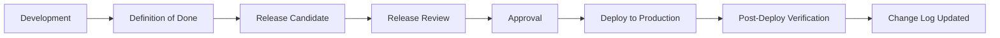

# Release Governance

**Phase:** 4.0 — Enterprise Platform Governance
**Status:** Official governance — architecture only
**Scope:** Education ERP Platform — semantic versioning, release lifecycle, environments, release checklist, change log, freezes, rollback
**Canonical source:** `docs/governance/Architecture-Governance.md`
**Reference standards:**
- `docs/governance/Engineering-Governance.md` (Definition of Done, quality gates)
- `docs/governance/Data-Governance.md` (migration promotion, backup/restore)
- `docs/governance/Integration-Governance.md` (contract lifecycle, deprecation)
- `docs/governance/Security-Governance.md` (vulnerability SLAs)

**Rule:** Architecture only. No implementation introduced by this document.

---

## 1. Purpose

This document governs how the platform is versioned, built, reviewed, released, and rolled back. It ensures every release is traceable, tested, compliant with architecture rules, and recoverable.

---

## 2. Semantic Versioning

Releases use `MAJOR.MINOR.PATCH`:

| Component | Increment when |
|---|---|
| MAJOR | Breaking change to published contracts, database schema non-additive change, removal of deprecated capability, architectural boundary change |
| MINOR | New backward-compatible capability, additive contract, additive migration |
| PATCH | Backward-compatible bug fix, documentation fix, no contract change |

Rules:

- Pre-release tags: `MAJOR.MINOR.PATCH-<tag>.<n>` for staging candidates.
- A release version is immutable once published.
- Published contract versions and platform versions align on breaking changes (Versioning Rules VR-02).

---

## 3. Environments

| Environment | Purpose | Rules |
|---|---|---|
| Local | Developer verification | Private data; no production data |
| Staging | Integration and release candidate validation | Mirrors production shape; masked data; full migration + contract tests |
| Production | Live operation | Approved release only; rollback plan required |

Promotion order is always `Local -> Staging -> Production`. Migrations are applied in sequence with no reordering.

---

## 4. Release Lifecycle

### 4.1 Release Candidate Requirements

- All Definition of Done items pass.
- Focused domain tests pass.
- Contract tests pass for all affected published contracts.
- Migrations validated on staging with masked data.
- Security scans pass with no critical/high open items.
- Architecture compliance verified.

### 4.2 Release Review

The release review confirms version, change log completeness, migration plan, rollback plan, backup availability, and compliance sign-off. Approval is required from the responsible owner (per `docs/governance/Decision-Matrix.md`).

---

## 5. Change Log

Every release updates the change log with:

- Version and date.
- Added / Changed / Deprecated / Removed / Fixed sections.
- Contract version changes.
- Migration numbers included.
- ADR/RFC references for material changes.
- Breaking-change notices with deprecation windows.

---

## 6. Release Freeze Windows

- A release freeze applies during critical operational periods (exam seasons, year boundaries).
- Freeze decisions are recorded and communicated.
- Hotfixes during a freeze require elevated approval and full rollback review.

---

## 7. Rollback

- Every release has a rollback plan defined before deployment.
- Rollback strategy depends on change type:
  - Additive migrations: backward-compatible; rollback by release revert.
  - Non-additive migrations: forward-recovery preferred; compensating migration documented; never edit an applied migration.
  - Data changes: restore from backup or compensating migration (see Data-Governance §7, §8).
- Post-deploy verification failures trigger the rollback decision.
- Backups are verified before deployment to support restore (`Data-Governance` §8).

---

## 8. Release Certification Checklist

- [ ] Semantic versioning applied.
- [ ] Environment promotion followed.
- [ ] Release candidate requirements met.
- [ ] Change log updated.
- [ ] Migration plan reviewed and applied in order.
- [ ] Rollback plan documented.
- [ ] Backup verified.
- [ ] Security checks passed.
- [ ] Consistent with Engineering, Data, Integration, and Security governance.
- [ ] No code, SQL, UI, or implementation introduced.

---

*End of Release Governance*

**Next:** Decision matrix and consolidated platform governance report.

