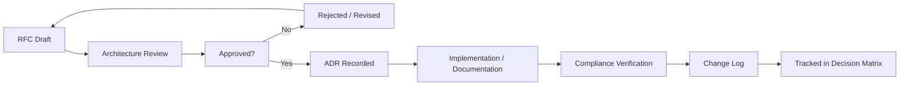

# Architecture Change Process

**Phase:** 4.0 — Enterprise Platform Governance
**Status:** Official process — architecture only
**Scope:** Education ERP Platform — how architecture changes are proposed, reviewed, approved, and tracked
**Canonical source:** `docs/governance/Architecture-Governance.md` (principles, dependency, naming, versioning, deprecation, backward compatibility, exceptions)
**Reference standards:**
- `docs/governance/Decision-Matrix.md` (approval paths)
- `docs/governance/Platform-Governance-Report.md` (Documentation Freeze)

**Rule:** Architecture only. No implementation introduced by this document.

---

## 1. Purpose

This document defines the lightweight, step-by-step process for changing the platform's architecture after the Phase 4.0 Documentation Freeze. It keeps documentation deliberate and traceable while allowing the platform to evolve.

---

## 2. Change Types

| Type | Description | Path |
|---|---|---|
| Minor | Clarification, additive documentation, non-material correction | Lightweight review |
| Material | New bounded context, breaking contract change, non-additive schema change, new external integration, new AI use case, deprecation, boundary change | Full RFC → ADR |
| Exception | Approved deviation from a rule | RFC (exception) + tracking in Decision Matrix |

---

## 3. Lifecycle

### Step 1 — RFC Draft

- Use `docs/rfc/RFC-Template.md`.
- Assign `RFC-<YYYY>-<NNN>`.
- Declare change type (Minor / Material / Exception).
- Identify affected governance documents and contracts.

### Step 2 — Architecture Review

- Material changes are reviewed by the Architecture Review.
- Security-sensitive changes include the Security Officer.
- AI use cases include the AI Governance Lead.
- Data/schema changes include the Data Owner.

### Step 3 — Decision

- Approved: proceed to ADR (Material) or documentation update (Minor).
- Rejected or revised: return to draft with review notes.

### Step 4 — ADR Recorded

- Material changes produce or update an ADR in `docs/adr/`.
- ADRs are immutable once accepted; corrections become new ADRs.

### Step 5 — Implementation / Documentation

- Update the Bounded Context Map, interaction architecture, governance documents, and contract registry as required.
- No implementation may start before the ADR is accepted and the affected documents are updated.

### Step 6 — Compliance Verification

- Verify the change against the dependency rules, naming rules, versioning, deprecation, and backward compatibility rules.
- Run the relevant contract and architecture checks.

### Step 7 — Change Log

- Record the change in the release change log with version, ADR/RFC references, and migration numbers.

### Step 8 — Tracking

- Update `docs/governance/Decision-Matrix.md` (approval path used, exception log if applicable).

---

## 4. Documentation Freeze Interaction

- After Phase 4.0 approval, no new strategic architecture documentation is added without an RFC.
- Approved RFCs that require documentation updates lift the freeze for the affected documents only.
- The frozen baseline remains authoritative until superseded by an approved change.

---

## 5. Change Type Examples

| Example | Type | Path |
|---|---|---|
| Add a nullable field to a published DTO | Minor | Lightweight review + version note |
| Add a new bounded context | Material | RFC + ADR + Bounded Context Map update |
| Change an event schema (removal) | Material | RFC + ADR + deprecation plan |
| Add a column to an existing table (non-additive) | Material | RFC + ADR + migration + rollback plan |
| Integrate a new payment provider | Material | RFC + ADR + ACL + security review |
| Register a new AI model for an approved use case | Minor | AI review + model registry update |
| Introduce a new AI use case touching PII | Material | RFC + ADR + privacy review |
| Bypass a naming rule temporarily | Exception | RFC (exception) + Decision Matrix tracking |

---

## 6. Certification Checklist

- [ ] RFC template exists.
- [ ] Change types are defined.
- [ ] Lifecycle steps are defined.
- [ ] ADR requirement is defined for material changes.
- [ ] Documentation Freeze interaction is defined.
- [ ] Decision Matrix integration is defined.
- [ ] Consistent with Architecture Governance.
- [ ] No code, SQL, UI, or implementation introduced.

---

*End of Architecture Change Process*

**Next:** Consolidate into the Platform Governance Report and close Phase 4.0.

